Arquitectura de Computadores
============================
2º Grado en Ingeniería Informática 2011/2012
--------------------------------------------

# Bloque Práctico 0. Entorno de programación.
### Germán Martínez Maldonado

#### 1. Escriba un programa en C y otro en C++ que sumen dos vectores de 32 componentes. Use Eclipse para la edición del código fuente, la generación del ejecutable y la ejecución.

Para hacer el programa, declaramos dos vectores con un tamaño fijo de 32 elementos, que inicializaremos directamente también en la declaración. También necesitaremos dos variables enteras, una para controlar las iteraciones que realicen para realizar la sumas de los vectores y otra que almacenará el resultado. Realizaremos la suma de todos los elementos de ambos vectores con un bucle, para después mostrar el resultado por pantalla y finalizar el programa.

**Código fuente de la versión en C:**

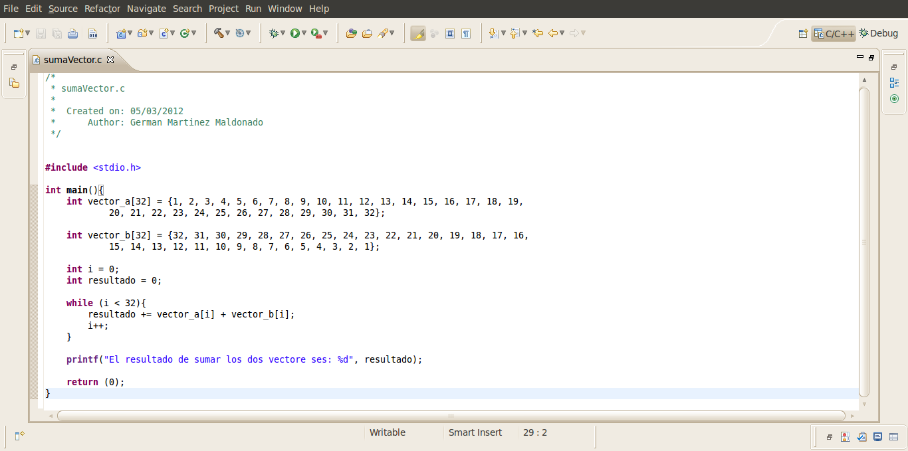

**Generación del ejecutable en C:**

**Ejecución del ejecutable en C:**

**Código fuente de la versión en C++:**

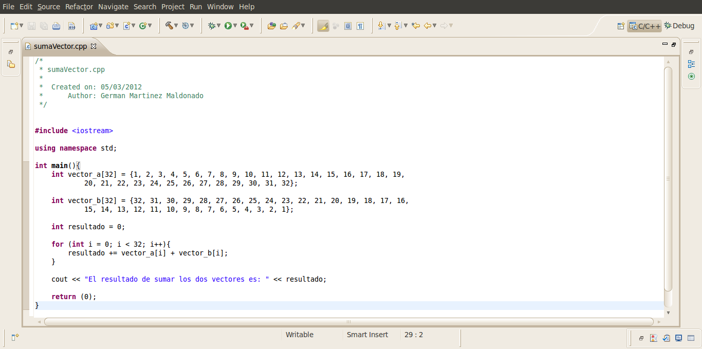

**Generación del ejecutable en C++:**

**Ejecución del ejecutable en C++:**

#### 2. Compare el código fuente C++ con el código C y escriba en su cuaderno de prácticas las diferencias.

Al ser un programa con una funcionalidad tan simple y estas ambas versiones en lenguajes tan similares como son C y C++, las diferencias son mínimas, encontrándose sólo las siguientes:

* Usan diferentes librerías para las funciones de entrada/salida (“stdio.h” en C y “iostream” en C++).
* Aunque el proceso de realizar la suma de todos los elementos de un vector es claramente iterativo, como en todas las iteraciones se realizará la misma acción y, se conoce de antemano el número total de iteraciones necesarias, la mejor opción es usar un bucle “for”, que es el que hemos usado para la versión en C++, el problema es que los bucles “for” no están permitidos en la versión de C que usamos con el compilador, así que para no tener que aumentar dificultad teniendo que añadir opciones de compilación específicas, usaremos un bucle “while” que puede realizar la misma función.
* El método para mostrar la salida por pantalla, mientras que en C es “printf” en C++ es “std::cout” (pero como estamos usando el espacio de nombres “std”, podremos llamar a la función simplemente “cout”).

#### 3. Ejecute paso a paso el programa en eclipse en alto nivel y en ensamblador.

Veamos cómo sería la ejecución paso a paso de la versión de C++, siendo en el caso de la versión de C, prácticamente igual.

Como vemos nada más empezar la depuración, vemos que las variables como no han sido todavía inicializadas, tienen valores aleatorios.

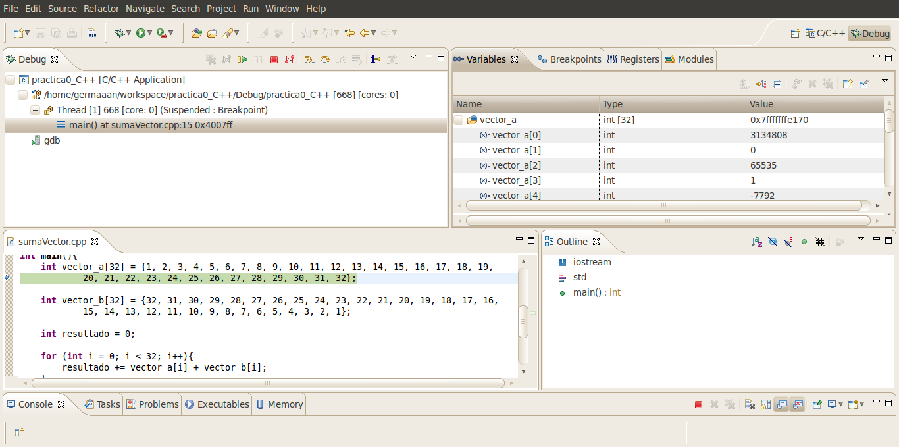

La primera iteración inicializa los elementos del primer vector, y ese cambio queda resaltado en la ventana que contiene el valor de las variables actuales. La situación será igual en el caso del otro vector.

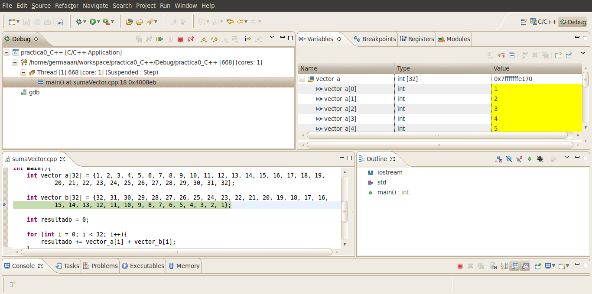

Una vez inicializados los vectores, declaramos e inicializamos a 0 la variable que almacena el valor del resultado de la suma.

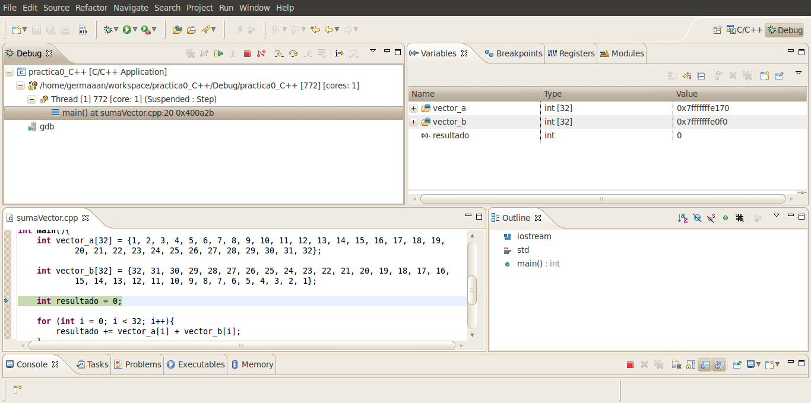

Y cuando se entra en el bucle, lo primero que se hace es declarar e inicializar la variable que usaremos como índice.

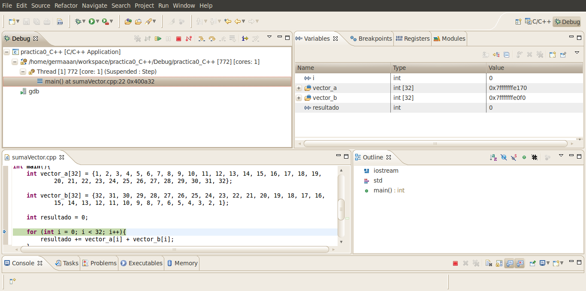

Con cada iteración del bucle, veremos cómo se resalta el valor de la variable “resultado”, lo que nos indicará que se va modificando.

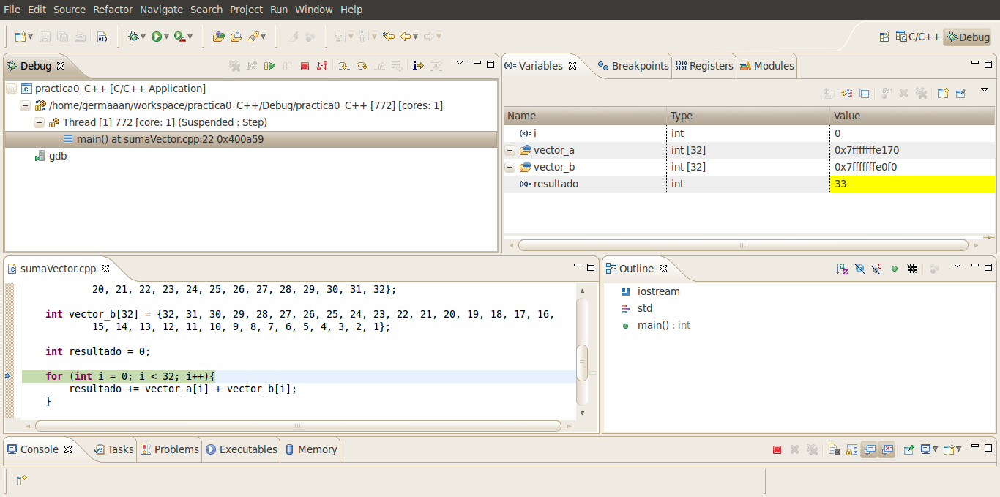

También comprobamos que la variable índice va incrementándose con cada iteración.

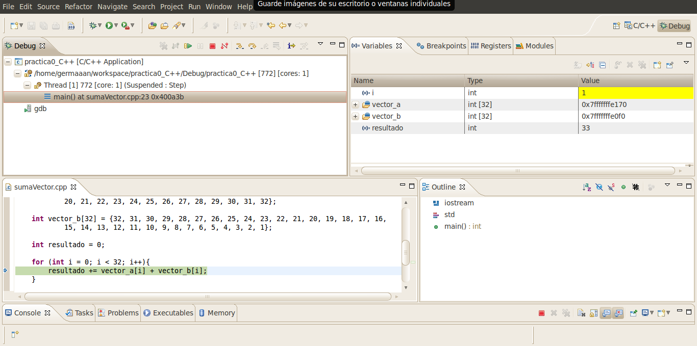

El proceso será el mismo para todas las iteraciones del bucle, se realiza la suma y se almacena en la variable.

Para acto seguido, incrementar la variable índice, volviendo a entrar en el bucle siempre que se siga cumpliendo la condición indicada.

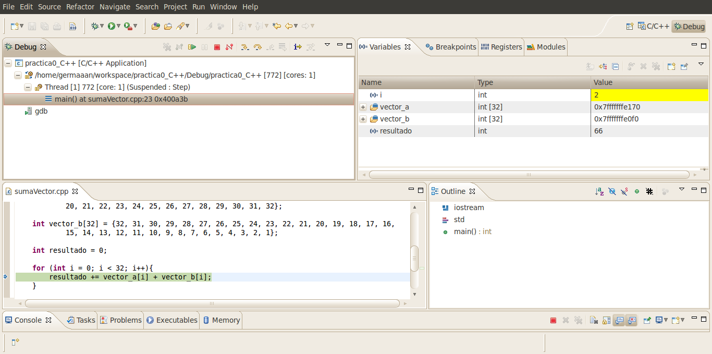

Una vez que la ejecución del bucle haya finalizado, será cuando se muestre por pantalla el valor de “resultado”, que como vemos en este caso es “1056”.

Se finaliza retornando el valor 0.

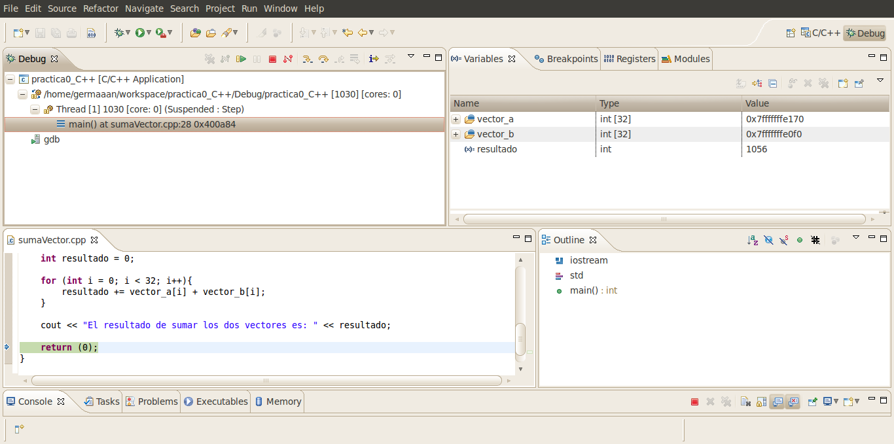

Y habremos llegado al final de la ejecución.

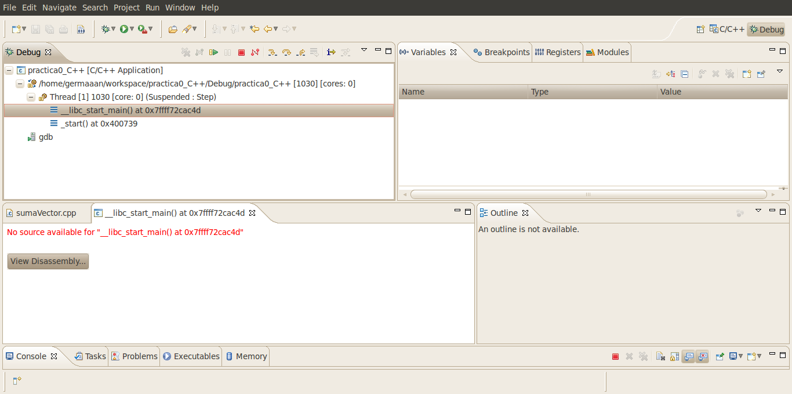

Ahora vamos a volver a realizar la ejecución paso a paso, pero viendo la información de las instrucciones ensamblador y los registros del procesador usados. Lo primero que hace es mover al registro “rbp” los valores de los componentes de los vectores, esto se hará con la instrucción “movl”.

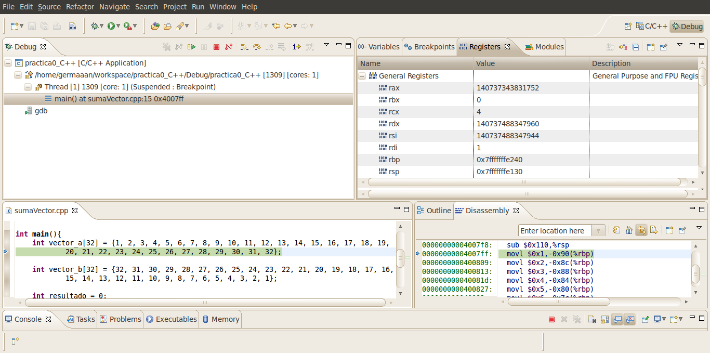

Moviendo también a otros registros correspondientes al resultado y al índice del bucle el valor 0.

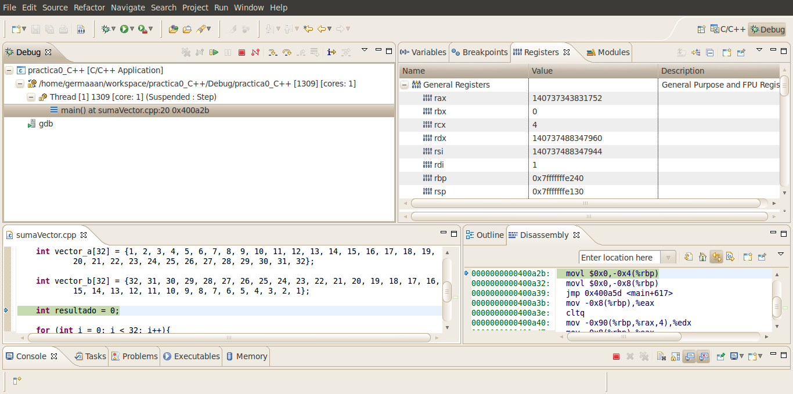

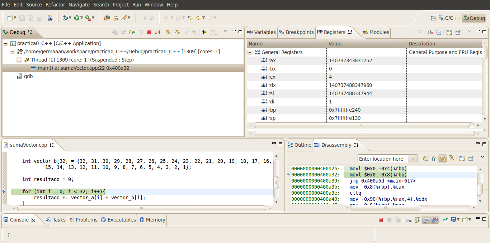

Se mueven los datos necesarios antes de realizar la operación de suma.

Y como vemos, han cambiado dos registros, “rax” que por su valor, vemos que es el registro que almacenará el resultado de la suma, y “rdx” que será el valor del índice del bucle.

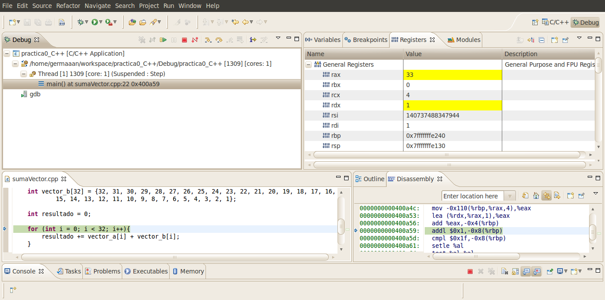

Como hemos visto cuando realizábamos la depuración en alto nivel, la misma acción del bucle se repetirá hasta que el flujo de ejecución salga de este.

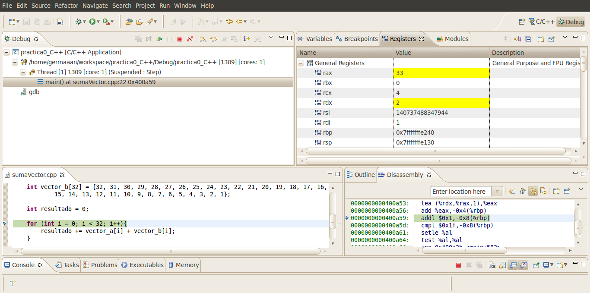

Se mueve a un registro la dirección del mensaje que queremos mostrar por pantalla.

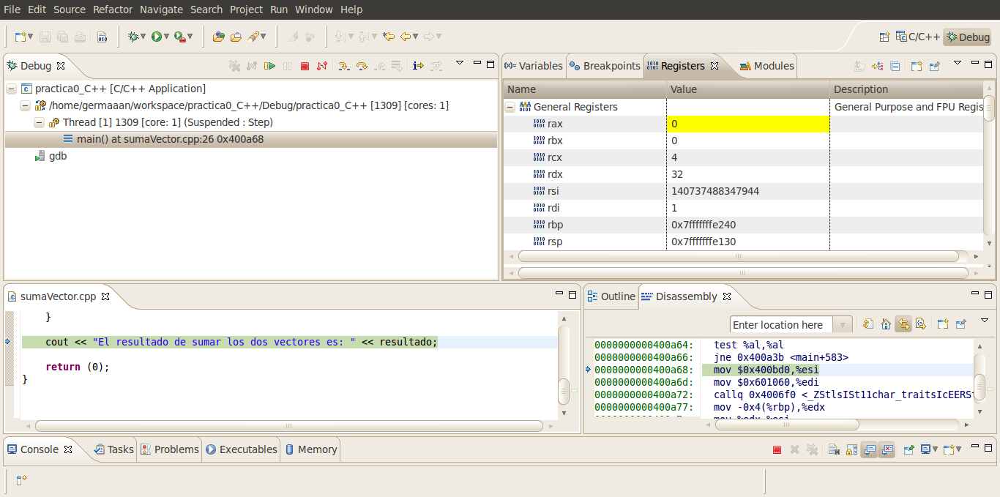

Y finalmente, se mueve a otro registro el valor que va a retornar el programa al finalizar.

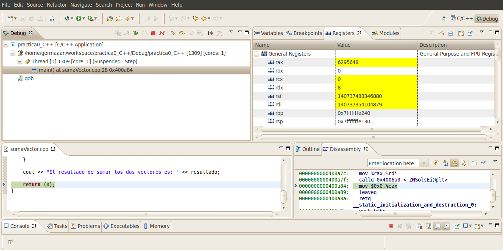

Dándose por finalizada la ejecución del programa.

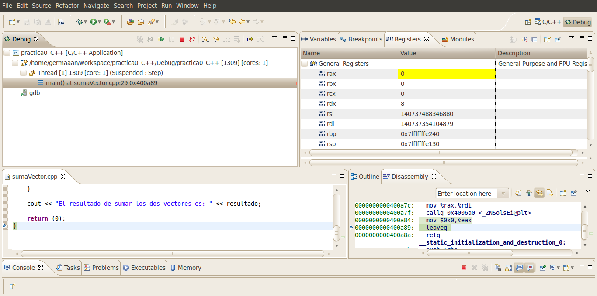

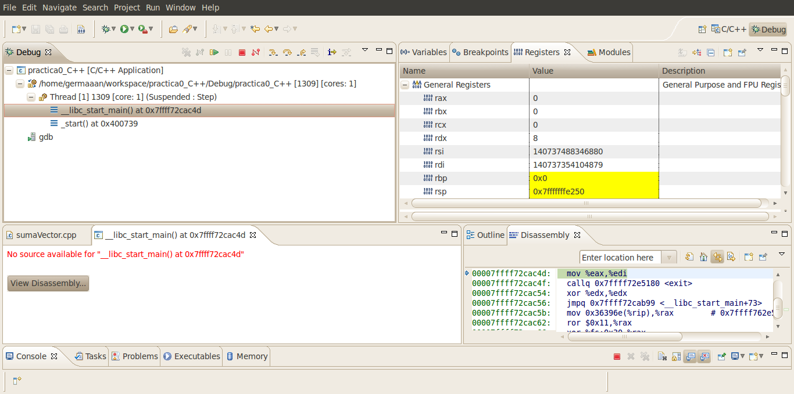
