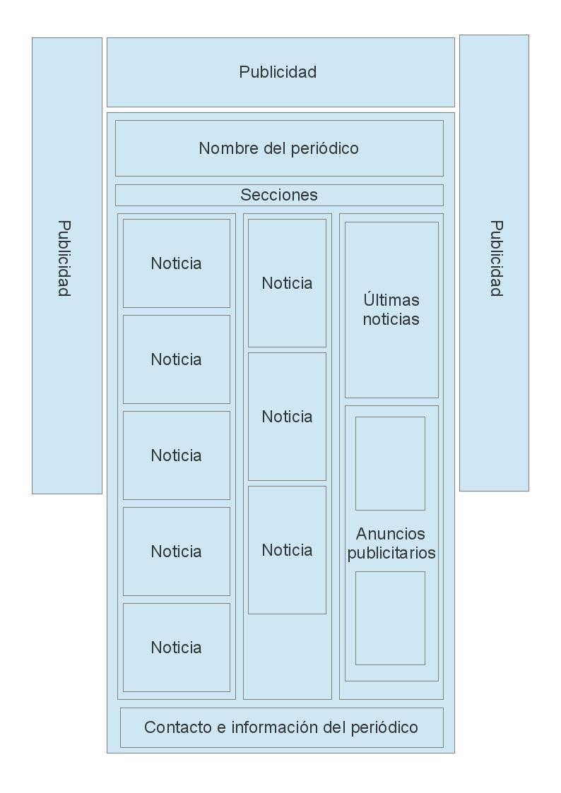
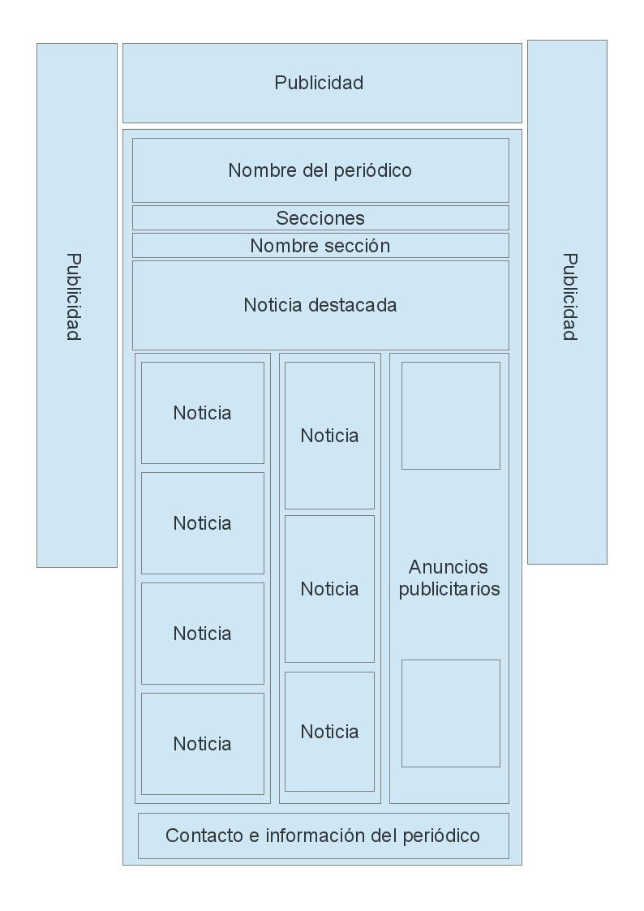
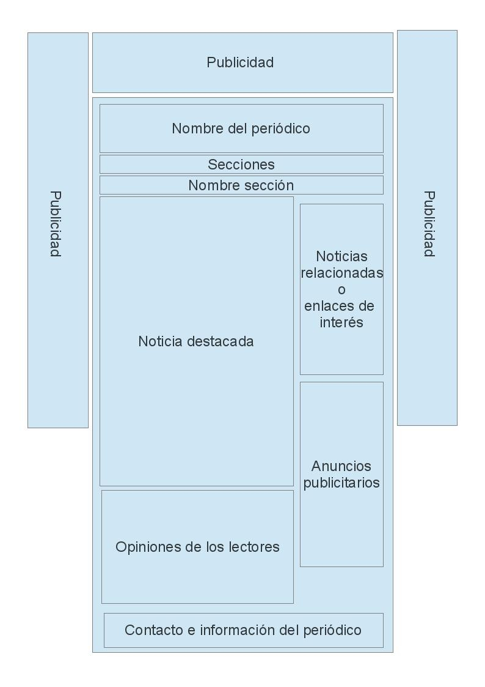
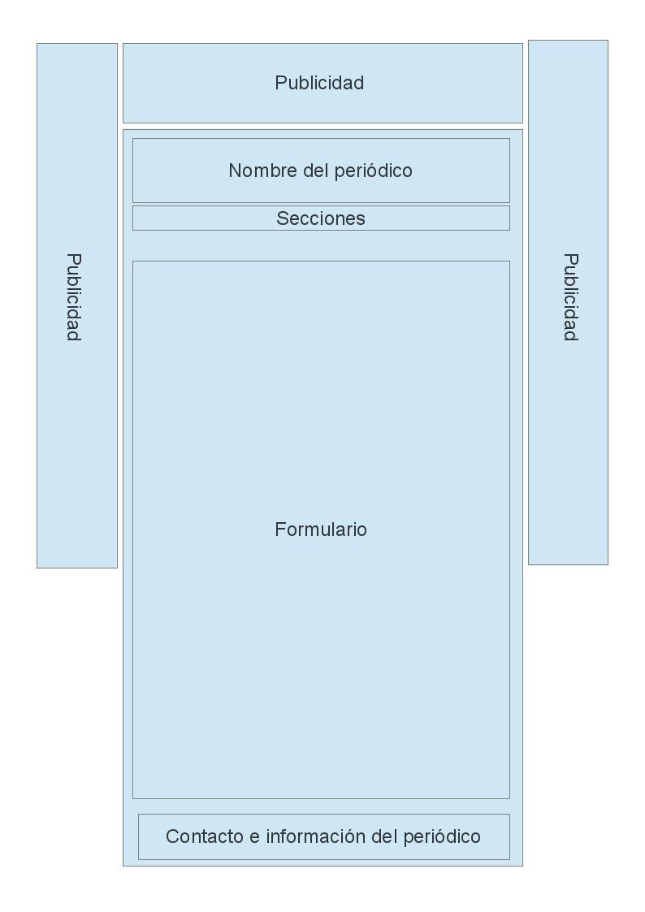
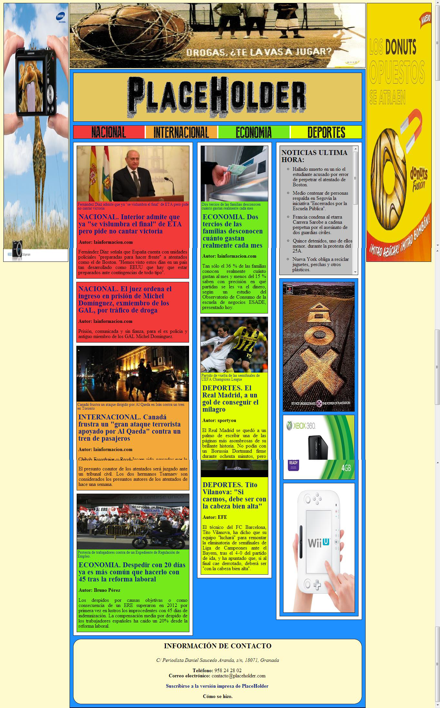
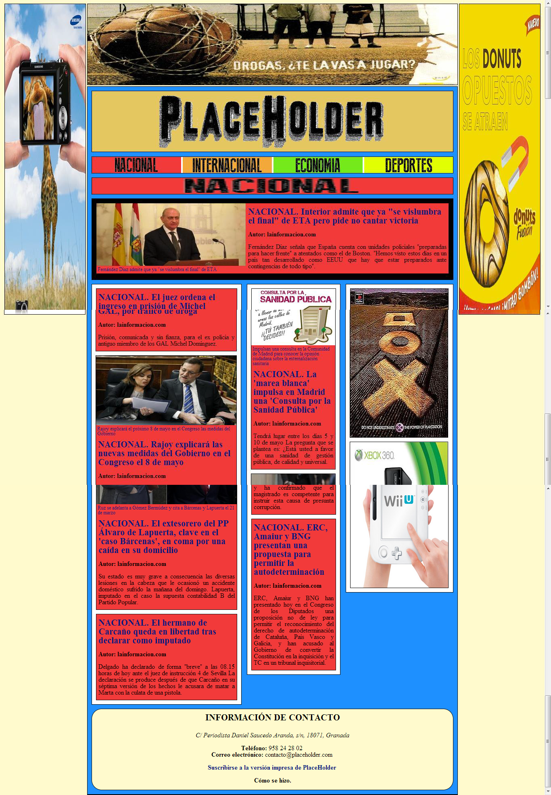
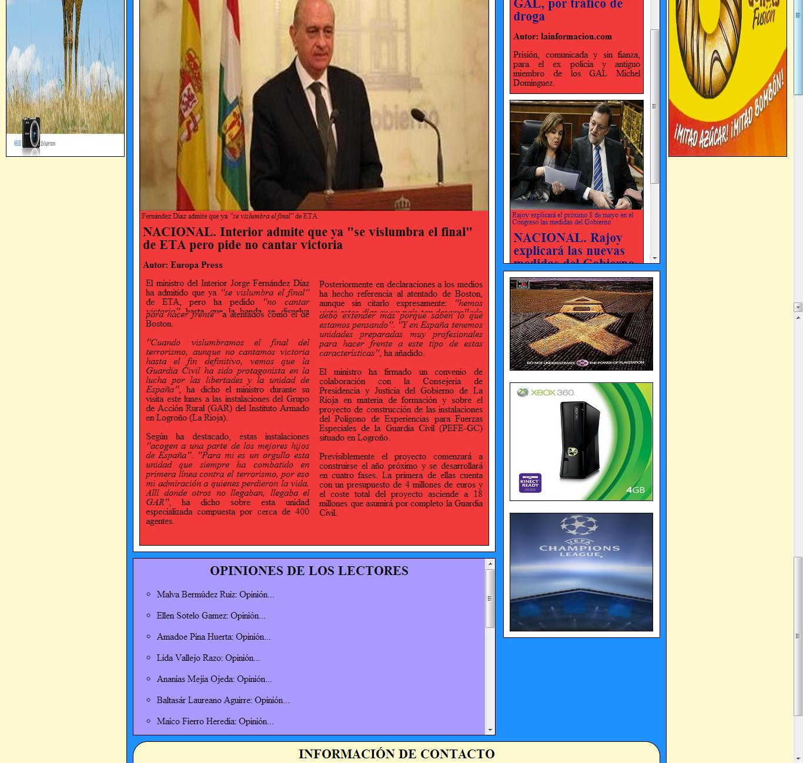

Tecnologías Web
===============
3º Grado en Ingeniería Informática 2012/2013
--------------------------------------------

# Práctica Evaluable I: Creación de la web de un periódico digital
### Germán Martínez Maldonado

## Creación de la web de un periódico digital

El objetivo de este primer ejercicio evaluable es poner en práctica los conocimientos adquiridos de HTML5 y CSS3, así como la capacidad para incorporar otros conceptos no estudiados en las clases de prácticas. El contexto será un periódico digital.

La edición digital del periódico consta una de portada con las principales noticias (titular, autor, un breve resumen y una posible imagen, con su pié correspondiente, o vídeo). Además, dicha página contiene el nombre del periódico, fecha, enlaces a sus secciones, y zonas dedicadas a la publicidad y a información sobre el periódico y contacto. Esta estructura es común a todas las secciones. La portada además almacena las noticias de última hora (sólo el texto).

Cada sección, la cual queda identificada claramente por su nombre, a su vez, mantendrá las zonas comunes indicadas anteriormente, una noticia destacada y la relación del resto que la componen (al igual que en la portada, titular, autor, breve resumen y una posible imagen o vídeo, con su pié correspondiente). Al pinchar en el titular de la noticia, se accederá a una página donde se desarrolla la misma, conteniendo textos e imágenes, así como una zona de enlaces a noticias relacionadas, las opiniones de los lectores y publicidad.

En cuanto a la información de contacto, se considerará la dirección postal, el teléfono y el correo electrónico del periódico, así como el nombre del autor de la misma, y también habrá un enlace a un formulario (lo más completo posible) para que el lector se pueda suscribir a la versión impresa del mismo.

En cuanto al aspecto, la portada estructurará sus contenidos según la figura 1, la página relacionada con una sección según la figura 2 , la asociada al desarrollo de cada noticia siguiendo la organización visual de la figura 3, y el formulario, a partir de la figura 4.

Cada noticia irá identificada de alguna forma por un color que se corresponde a la sección a la que pertenece. En la zona de secciones, cada una de ellas estará asociada a un color que la caracteriza.

Tanto las noticias relacionadas, las opiniones de los lectores y las noticias de última hora estarán ubicadas en un **“contenedor”** en el que aparezca una barra de desplazamiento vertical.

El aspecto visual de los elementos queda a la imaginación de cada uno.

## Evaluación

La evaluación de esta práctica dependerá de los siguientes elementos:
* Organización adecuada de los contenidos.
* Diseño visual.
* Inclusión de aspectos innovadores no vistos en clase.
* Documentación de la práctica.

## Entrega

* Deberá existir un directorio denominado **periodico** y un fichero **index.html** que contenga la portada. Las páginas relativas a las secciones se denominarán como la sección (**internacional.html, deportes.html, etc.**), y las noticias estarán almacenadas en directorios que se llamen como las secciones (**internacional, deportes, etc.**) y se nombrarán con las cuatro primeras palabras con sentido del titular separadas por guiones bajos y la fecha en el formato aaaammdd (**granada_pierde_ante_betis_20130405.html**). Las imágenes asociadas a una noticia irán ubicadas en un directorio con la misma denominación que la noticia (sin la extensión: **granada_pierde_ante_betis_20130405**).
* En la zona de información general y de contacto, aparecerá un enlace denominado **“**cómo se hizo**”**, el cual apuntará a un fichero pdf, ubicado en el directorio **periodico**, que contendrá una descripción del trabajo realizado, haciendo especial énfasis en los aspectos innovadores de la práctica.

Figura 1: Estructura visual de la portada del periódico digital.

Figura 2: Estructura visual de cada sección del periódico digital.

Figura 3: Estructura visual de una noticia del periódico digital.

Figura 4: Estructura visual del formulario de suscripción al periódico impreso.

## Descripción

El objetivo de esta práctica es la de crear un periódico digital en el que podremos distinguir 4 diferentes plantillas de forma de página, por lo que el estilo de cada una de esas plantillas irá definido por una hoja CSS, pero todas basándonos en el modelos de cajas (sobretodo aplicado a elementos **“section”** y **“article”**) y usando muchos identificadores **“id”** y **“class”**, para especificar diferentes elementos de un mismo tipo que van a tener diferentes estilos. Lo primero que hacemos en cada uno de las hojas CSS es **“resetear”** los elementos que vamos a usar, como vimos en los guiones de prácticas, para asegurarnos que los navegadores obligatoriamente aplicaran las propiedades a los elementos de la forma que nosotros las definamos. Con todo esto, el aspecto de cada una de las página quedará de la siguiente forma:

* **Página principal**: el esquema de la página principal será muy parecido al que seguirán el resto de las secciones. Primero tenemos 3 espacios de publicidad (la imagen superior y las imágenes a los lados) que se corresponderían con 3 elementos **“aside”** que hemos colocado con posicionamiento absoluto.

Todo el bloque central está incluido en una mismo elemento **“section”**, donde todos los elementos sin elementos a su izquierda están posicionados relativamente entre sí, así no será necesario indicar una altura fija al bloque, permitiéndonos un mayor dinamismo (la columnas central y derecha están situadas de forma absoluta), además los elementos no estarán totalmente juntos entre sí, ya que contarán con mínimo un margen de 10 pixeles.

El nombre del periódico es un elemento **“header”** con una imagen que a su vez funciona de enlace hacia la propia página principal. Las secciones son un elemento **“nav”** en el que se han insertado imágenes con el nombre de cada una de las secciones, que funcionan con vínculo de acceso a cada una de las secciones.

La información está repartida en 3 columnas, siendo cada columna un elemento **“section”**. Las columnas de la izquierda y derecha están compuestas por elementos **“article”** que son las correspondientes noticias, tanto la imagen (la noticia que contenga imagen) como el titular de la noticia, son los enlaces hacia la página de dicha noticia. Un caso particular son las noticias que son acompañadas por video, esos videos los hemos insertado mediante elementos **“iframe”**, elementos no vistos en clase, pero que se recomienda en varias fuentes porque pertenece al estándar HTML5, y no depende de formatos como el Flash, que puede necesitar de complementos para funcionar en el navegados.

La columna de la derecha se divida en 2 partes, la superior, que es elemento **“article”** que contienen una lista no ordenada (elemento **“ul”**) que contiene noticias de última hora de las que solo se tiene el texto en portada, como se pedía, esta sección cuenta con una barra de desplazamiento vertical que se inserta añadiendo **“overflow: auto”** a la sección correspondiente en el archivo CSS. La parte inferior, corresponde a publicidad, que son elementos **“aside”** con imágenes publicitarias.

Finalmente nos queda el apartado de contacto e información del periódico, esta sección es un elemento **“footer”**, que contendrá un párrafo con la información correspondiente y además, los enlaces solicitados hacia una página con un formulario de suscripción y otro hacia este mismo documento en formato PDF alojado en el servidor con los archivos de la página web. A destacar que se ha usado una propiedad nueva de CSS3, que nos permite hacer que los bordes aparezcan redondeados, para ello le hemos añadido al elemento **“footer”** en la hoja CSS la propiedad **“border-radius”**.

* **Página de una sección**: como vemos el esquema general de la  página de una sección es básicamente igual al de la página principal, encontrándonos solo como diferencias que aparece una cabecera con el nombre de la sección (un elemento **“section”** con una imagen en su interior), y la noticia destacada (otro elemento **“section”**  que contiene un elemento **“article”** con el contenido de la noticia).

* **Página de una noticia**: la página con el contenido de una noticia, comparte la parte superior con el mismo esquema de la página de una sección, pero el cuerpo es diferente, primeramente nos encontramos una gran columna a la izquierda, que será un elemento **“section”** con todo el contenido de la noticia (texto, imagen o video), además usando otra propiedad de CSS3 hemos dividido en texto en diferentes columnas, esto lo hemos hecho añadiendo en el CSS al elemento **“p”** de clase correspondiente las propiedades **“column-count”**, **“-moz-column-count”** (para asegurar la compatibilidad con Mozilla) y  **“-webkit-column-count”** (para asegurar compatibilidad con Safari y Chrome).

La columna de la derecha se dividirá  en 2 secciones, la  de arriba que contendrá noticias relacionadas a la noticia actual (contando con una barra de desplazamiento vertical como se indicaba) y la de abajo con publicidad, ambos usando elementos ya descritos.

Debajo de la columna que contiene la información de la noticia, nos encontramos un elemento **“section”** que contiene una lista desordenada con las opiniones de los lectores por la que también nos podemos desplazar con la barra de desplazamiento. En la parte más baja podemos encontrar la sección con información de contacto que es exactamente igual a las de las páginas anteriores.

* **Formulario de suscripción**: la última página es un formulario de suscripción a la edición impresa, en este caso tenemos un elemento **“section”** central con un formulario con varios campos, que una vez los introduzcamos y pulsemos el botón de enviar, nos llevará a una página donde se confirmará nuestra suscripción.

A destacar que, por algún motivo en el navegador Chrome, si visitamos la pagina web, las imágenes de los elementos **“aside”** no son mostrados, mientras que si accedemos con Firefox, se ve sin ningún problema.
