Seguridad y Protección de Sistemas Informáticos
===============================================
4º Grado en Ingeniería Informática 2013/2014
--------------------------------------------


# Taller de algoritmos simétricos: modos, padding y errores
### Germán Martínez Maldonado
### José Manuel Castillo Pérez

## ÍNDICE

1. [Introducción y objetivos](README.md#1-introducci%C3%B3n-y-objetivos)
2. [Algoritmos](README.md#2-algoritmos)
3. [Modos](README.md#3-modos)
4. [Errores](README.md#4-errores)
5. [Programa](README.md#5-programa)
6. [Clases](README.md#6-clases)
7. [Código](README.md#7-c%C3%B3digo)
8. [Manual de usuario](README.md#8-manual-de-usuario)
9. [Documentación de la API de la aplicación](README.md#9-documentaci%C3%B3n-de-la-api-de-la-aplicaci%C3%B3n)
 * a. [Clase SiCoEn.Encriptador](README.md#clase-sicoenencriptador)
 * b. [Clase SiCoEn.Filtro](README.md#clase-sicoenfiltro)
 * c. [Clase SiCoEn.Formato](README.md#clase-sicoenformato)
 * d. [Clase SiCoEn.Interfaz](README.md#clase-sicoeninterfaz)
 * e. [Clase SiCoEn.SiCoEn](README.md#clase-sicoensicoen)
 * f. [Clase SiCoEn.Texto](README.md#clase-sicoentexto)
10. [Conclusiones](README.md#10-conclusiones)
11. [Bibliografía](README.md#11-bibliograf%C3%ADa)

## 1. Introducción y objetivos

En la criptografía, los algoritmos simétricos son aquellos que utilizan la misma clave para cifrar y descifrar un mensaje. Para que esto se pueda producir, el emisor y el receptor se ponen de acuerdo sobre la clave a usar, así que primero el emisor cifra el mensaje utilizando dicha clave, luego envía dicha clave al receptor, y así, este puede descifrar el mensaje haciendo uso de la misma clave.

También hay que tener en cuenta que los mensajes no siempre son enviados de la misma forma, en este caso nos vamos a centrar en algoritmos que transmiten la información cifrada en bloques, por lo que tendremos que conocer cuál es el funcionamiento de dichos modos de cifrado en bloques.

El objetivo de este proyecto es el de crear una aplicación para comprobar el funcionamiento de distintos algoritmos modernos de descifrado simétricos y conocer cómo  funcionan  los distintos modos de cifrado en bloque disponibles.

Para este objetivo vamos a crear una aplicación en la que además de cifrar y descifrar texto con los diferentes algoritmos, vamos a introducir diferentes errores en el proceso para comprobar cómo el uso de un modo de cifrado u otro puede hacer que estos errores repercutan en el resultado final.


## 2. Algoritmos

Los algoritmos que se van a usar en la aplicación son los siguientes:

* **AES (Advanced Encryption Standard)**: es un sistema de cifrado en bloques que desde 2002 es un estándar efectivo de cifrado usado por el gobierno de Estados Unidos. Fue desarrollado por los criptólogos belgas Joan Daemen y Vincent Rijmen y enviado al concurso AES de sistemas de cifrado bajo el nombre Rijndael. AES tiene un tamaño de bloque fijo de 128 bits y tamaños de llave de 128, 192 o 256 bits. Es uno de los algoritmos más populares usados en la criptografía simétrica.

* **Blowfish**: es también un sistema de cifrado mediante bloques simétrico, diseñado por Bruce Schneier en 1993. Diseñado como un algoritmo de uso general, su intención era reemplazar a DES. Blowfish usa bloques de 64 bits y claves que van desde los 32 bits hasta los 448 bits. Realiza la codificación en 16 rondas y usa llaves que dependen de las S-Cajas.

* **DES (Data Encryption Standard)**: otro sistema de cifrado haciendo uso de bloques. Fue escogido como estándar de cifrado por el gobierno de Estados Unidos en 1976. Parte de su diseño es desconocido, usa bloques de 64 bits y el tamaño de sus claves es muy corto (56 bits), por lo que se considera inseguro. Por lo que finalmente fue sustituido por AES.

* **Triple DES**: este sistema es una triple implementación del cifrado mediante el algoritmo AES. Desarrollado en 1998 por IBM cuando se descubrió que la clave de 56 bits de DES no era suficiente para evitar ataques por fuerza bruta.


## 3. Modos

También es importante conocer los diferentes modos que van a ser usados por el programa, en este caso esos son:

* **CBC (Cipher-Block Chaining)**: con este modo a cada bloque de texto llano se le aplica una operación XOR con el bloque cifrado anterior antes de ser cifrado. Para hacer cada mensaje único se utiliza un vector de inicialización.


* **CFB (Cipher FeedBack)**: cada bloque de texto llano se realimenta con el texto cifrado o parte del mismo para ser nuevamente cifrado realizando una operación XOR con el texto llano.


* **ECB (Electronic Code-Block)**: en este modo los mensajes se dividen en bloques y cada bloque es cifrado por separado utilizando la misma clave.

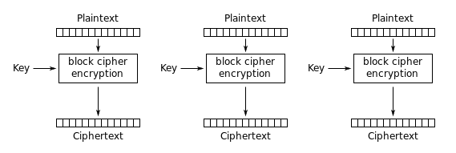

* **OFB (Output FeedBack)**: este modo de cifrado es similar al modo de cifrado CFB, excepto que utiliza realimentación interna.

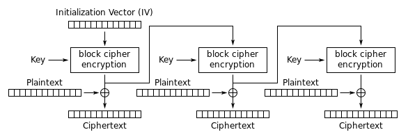


## 4. Errores

Los diferentes errores que vamos a introducir en los mensajes van a ser los siguientes:

* **Error en el texto plano**: consiste en introducir un bit de error en el texto plano antes de ser codificado. Esto producirá el siguiente comportamiento en los diferentes modos de cifrado:
 * **Modo CBC**: 1 bit erróneo afecta a todo el texto a continuación. Al descifrar se invierte el error y se queda el texto llano original con el bit de error.
 * **Modo CFB**: el error afecta a todo el texto cifrado de la misma forma que en CBC, pero igualmente se invierte al descifrar.
 * **Modo ECB**: el receptor va a recibir un bloque entero erróneo que no va a poder recuperar.
 * **Modo OFB**: como pasaba en el modo anterior, el error que se produzca no se puede recuperar.

* **Error en la comunicación**: se produce un error en el proceso de comunicación entre emisor y receptor. Como mínimo un bit del texto codificado es alterado durante la transmisión, lo que producirá el siguiente resultado según el modo de cifrado:
 * **Modo CBC**: el error va a provocar que todos los bloques siguientes estén cambiados en la misma posición que el bloque con el error original. Este efecto se invierte al descifrar.
 * **Modo CFB**: el error va a producir un cambio de 8 caracteres en el texto llano de salida, pero que al descifrar el texto se recupera.
 * **Modo ECB**: el error cambia un bloque entero, por lo tanto, el receptor va a ver el mensaje bien menos ese bloque (error en 8 caracteres).
 * **Modo OFB**: el error en un 1 bit afecta únicamente a un byte, por lo que solo cambiará un carácter.

* **Error en la sincronización**: se produce un error en el desplazamiento de un bloque a codificar. La posición de inicio de un bloque no es recibida correctamente, esto hace que se retransmita erróneamente con todos los bits desplazados. Producirá un efecto final según el modo como sigue:
 * **Modo CBC**: el texto no se va a poder recuperar ya que vamos a generar basura indefinidamente.
 * **Modo CFB**: empezamos a generar basura, pero al cabo de 9 bits el sistema se recupera y recuperamos el texto. Esto es debido a la retroalimentación del algoritmo.
 * **Modo ECB**: no se puede descifrar nada ya que se generará basura constantemente.
 * **Modo OFB**: como pasa en los casos que no hay comunicación directa entre emisor y receptor, no se podrá recuperar el texto plano original.


## 5. Programa
El programa que hemos desarrollado le hemos dado el nombre de SiCoEn (Simulación de Codificación en Envío). Con el objetivo de que sea  una  aplicación  que  se puede  ejecutar fácilmente en cualquier sistema operativo, ha sido desarrollado en Java, concretamente bajo la versión más reciente, Oracle Java Development Kit (JDK 7). Además se ha usado el entorno de desarrollo NetBeans IDE 7.4, ambas aplicaciones se   pueden  obtener  en  la  dirección “[http://www.oracle.com/technetwork/es/java/javase/downloads/jdk-7-netbeans-download-432126.html](http://www.oracle.com/technetwork/es/java/javase/downloads/jdk-7-netbeans-download-432126.html)”.

Podemos dividir la descripción del programa en dos partes: un parte genérica y una parte específica. La parte genérica abarca aspectos más comunes de cualquier programa de propósito general, en este caso el tratamiento de entradas y salidas de información y la interfaz gráfica. Como las operaciones de entrada/salida se harán sobre ficheros, usaremos el paquete **“java.io”**, que nos proporcionará la posibilidad de serialización de información y un sistema de archivos para trabajar con nuestro flujo de datos. En concreto las clases usadas serán:

* **BufferedReader/BufferedWriter**: provee un buffer para poder realizar las operaciones de entrada/salida de forma eficiente.
* **FileInputStream/FileOutputStream**: provee del flujo de entrada/salida para leer o escribir información en archivos.
* **InputStreamReader/OutputStreamWriter**: provee del puente que permite pasar de un flujo de caracteres a un flujo de bytes, necesarios para leer o escribir información.
* **Diferentes clases relacionadas con las excepciones**: archivo no encontrado, error entrada/salida, codificación no soportada.

En cuanto al apartado visual, todo está gestionado por el paquete **“javax.swing”**. Este paquete nos proporciona todo el conjunto de componentes ligeros que necesitaremos para realizar nuestra interfaz gráfica: paneles, barras de menú o botones, entre otros.

La parte específica de la aplicación es la que estará relacionada con el contenido de la asignatura, criptografía y seguridad. El paquete **“javax.crypto”** será el que nos proporcione las clases e interfaces para las operaciones criptográficas. Concretamente las clases que se han usado (que se detallarán más adelante) son las siguientes:

* **Cipher**
* **CipherInputStream/CipherOutputStream**
* **KeyGenerator**
* **SecretKey**
* **IvParameterSpec**

Además también tenemos que gestionar diferentes excepciones y errores que se produzcan durante la ejecución del programa, para ello hemos usado el paquete **“java.security”**. Este paquete proporciona las clases e interfaces para poder tener el marco de seguridad necesario. En la práctica, concretamente nos proporciona los mecanismos de gestión de excepciones para errores tales como parámetros del algoritmo inválidos, llaves generadas inválidas o algoritmos no soportados en el sistema.


## 6. Clases

Como se ha comentado en el apartado anterior, son varias las clases que se han usado para el desarrollo de la parte específica de criptografía de la aplicación, así que vamos a hacer enumeración detallada de las mismas. La funcionalidad de estas clases se encuentra desarrollada en la clase **“Encriptador”** de nuestra aplicación.

* **KeyGenerator**: esta clase nos proporcionará la funcionalidad de generar las claves simétricas secretas que vamos a usar para el cifrado. Un generador solo puede generar llaves para el algoritmo específico que le indiquemos, además tiene que ser inicializado con el número de bits de longitud que tendrán las llaves generadas.

```
KeyGenerator generador;

generador = KeyGenerator.getInstance("AES");
generador.init(128);

generador = KeyGenerator.getInstance("Blowfish");
generador.init(128);

generador = KeyGenerator.getInstance("DES");
generador.init(56);

generador = KeyGenerator.getInstance("TripleDES");
generador.init(168);
```

* **SecretKey**: esta interfaz realiza una implementación de la interfaz Key, será la que defina las funcionalidades de las llaves secretas. En el paquete **“javax.crypto”** todas las llaves tienen las siguientes 3 características que hay que tener en cuenta:
 * Una llave funciona solo con el algoritmo establecido.
 * La llaves se codifican en un forma estándar (como X.509 Subject Public Key Info o PKCS#8)
 * Un formato específico (ejemplo: llave privada o llave pública)

Para usar este tipo de llaves, las generamos usando el generador de llaves que hemos descrito anteriormente.

```
SecretKey clave;
clave = generador.generateKey();
```

* **IvParameterSpec**: será la clase con la que especificaremos el vector de inicialización. Se crea usando un array de bytes del tamaño del vector, en este caso todos tiene un tamaño de 8 bytes, menos AES que usa un vector de 16 bytes.

```
IvParameterSpec iv;

iv = new IvParameterSpec(new byte[8]);
iv = new IvParameterSpec(new byte[16]); // AES
```

* **Cipher**: está es la clase que usando todos los elementos generados por las clases descritas, proporcionará la funcionalidad del sistema de cifrado criptográfico para el cifrado y el descifrado. Todos los elementos que se usen de esta clase serán válidos para una única configuración, por lo generaremos cada vez que vayamos a realizar una acción de cifrado o descifrado tomando como parámetros las opciones seleccionadas con el menú del programa. Los parámetros necesarios serán el algoritmo de cifrado, el modo de funcionamiento de los bloques y el padding con el que serán completados los mismos. Pudiendo ser este caso los siguientes valores:
 * **ALGORITMO**: AES / Blowfish / DES / TripleDES
 * **MODO**: CBC / CFB / ECB / OFB
 * **PADDING**: PKCS5Padding / ISO10126Padding

Una vez obtenidos los parámetros, se obtendrá una instancia de la clase, siendo necesario inicializarla antes de poder usarla. Para inicializarla es necesario indicar si va a ser usada para cifrar o descifrar mensajes, y además la clave secreta y el vector de inicialización usados.

```
Cipher cifrador;
cifrador = Cipher.getInstance(“ALGORITMO/MODO/PADDING”);

cifrador.init(Cipher.ENCRYPT_MODE, clave, iv);
cifrador.init(Cipher.DECRYPT_MODE, clave, iv);
```


## 7. Código

Aunque se incluirá una sección con la documentación de la API del código fuente de la aplicación, consideramos importante describir específicamente unas partes fundamentales del código como son:

* **Cifrado del mensaje.**
* **Descifrado del mensaje.**
* **Generación del error en el texto plano.**
* **Generación del error en la comunicación.**
* **Generación del error en la sincronización.**

Para realizar el cifrado del mensaje, primero creamos un array de bytes que usaremos como buffer para ir almacenando la información de los bloques que se van cifrando. Ahora creamos el cifrador para cifrar el mensaje. Después creamos los flujos de entrada y salida de información. Finalmente, creamos un flujo de salida de cifrado que dirija hacia un archivo de texto la salida generado por el elemento cifrador, y vamos leyendo hacia  el buffer, bloque a  bloque el contenido del archivo a cifrar para una vez cifrado, escribirlo en el archivo de salida.

* **Extracto de código del método “cifrar” de la clase “Encriptador”:**

```
byte[] block = new byte[8];
Cipher cifrador = generarCifrador(Encriptador.CIFRADOR);

FileInputStream fis = new FileInputStream(origen);
FileOutputStream fos = new FileOutputStream(destino);

try (CipherOutputStream cos = new CipherOutputStream(fos, cifrador)) {
    while ((i = fis.read(block)) != -1) {
        cos.write(block, 0, i);
    }
}
```

El descifrado de mensajes se hará de forma muy similar, creamos primero el array de bytes que usaremos como buffer. Ahora creamos los flujos de entrada tanto del fichero con el texto cifrado como del descifrador, creamos también un flujo de salida de bytes donde se almacenará temporalmente la información descifrada. Solo queda recorrer todo el archivo cifrado para ir descifrándolo bloque a bloque.

* **Extracto de código del método “descifrar” de la clase “Encriptador”:**

```
byte[] block = new byte[8];
Cipher descifrador = generarCifrador(Encriptador.DESCIFRADOR);

FileInputStream fis = new FileInputStream(origen);
CipherInputStream cis = new CipherInputStream(fis, descifrador);
ByteArrayOutputStream baos = new ByteArrayOutputStream();

while ((i = cis.read(block)) != -1) {
    baos.write(block, 0, i);
}
```

Para introducir un error en el texto plano, primero obtenemos el texto de la ventana, transformamos dicho texto a un array de bytes, y le hacemos una operación XOR aun bit del bloque hayamos seleccionado. Con la operación XOR 1 nos aseguramos que el valor del bit afectado siempre cambiará.

* **Extracto de código del método “opcion_error_cifrado” de la clase “Interfaz”:**

```
String texto = ventanaActual.getTexto();
byte[] bytes = texto.getBytes("UTF-8");
bytes[valorNumBloque] = (byte) (bytes[valorNumBloque] ^ 1);
```

Para introducir un error en la comunicación, seguimos el mismo planteamiento que con el error anterior, la diferencia es que esta vez el texto sobre el que realizaremos el XOR es sobre el texto cifrado, simulando que ha habido un error durante la comunicación que ha hecho que el valor de ese bit no se transmita correctamente.

* **Extracto de código del método “accion_error_com_1” de la clase “Interfaz”:**

```
String textoCif = encriptador.cifrar(origen);
byte[] bytes = texto.getBytes("UTF-8");
bytes[valorNumBloque] = (byte) (bytes[valorNumBloque] ^ 1);
```

Para introducir un error en la sincronización, también obtenemos el texto ya cifrado y obtenemos su representación en un array de bytes. Lo que haremos en este caso es desplazar en una posición los bits del bloque indicado, simulando que durante la transmisión del mensaje se equivocó al indicar donde se iniciaba el bloque desplazado.

* **Extracto de código del método “opcion_error_sincronizacion” de la clase “Interfaz”:**

```
String textoCif = encriptador.cifrar(origen);
byte[] bytes = textoCif.getBytes("UTF-8");
bytes[valorNumBloque] = (byte) (bytes[valorNumBloque] >> 1);
```


## 8. Manual de usuario

Antes de usar el programa, es necesario aprender a usar las funcionalidades del mismo, hemos incluido un manual de usuario para explicar el funcionamiento del programa.

Para poder ejecutar la aplicación es necesario tener instalado Java Runtime Environment (JRE) 7, que se puede descargar para diferentes sistemas desde “[http://www.java.com/es/download/](http://www.java.com/es/download/)”.

En la siguiente imagen podemos ver la ventana principal que veremos cuando iniciemos el programa. Es una interfaz muy simple, tenemos una barra de menús en la zona superior donde encontraremos todas las opciones que podemos usar y un espacio escritorio que será donde posicionemos nuestras ventanas con texto, ya sea este sin codificar o codificado.

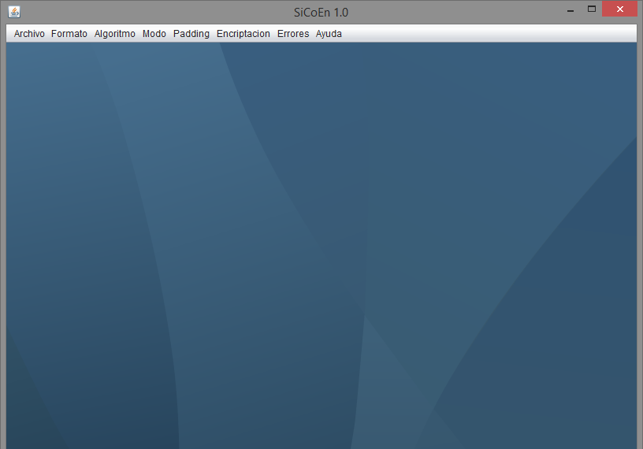

### Menú Archivo:

Este menú nos permitirá realizar las operaciones de creación, apertura o guardado del texto que tengamos o queramos cargar en nuestra ventana de texto hacia o desde archivos de texto. También nos dará la opción de salir del programa.


Si pulsamos **“Nuevo”**, nos aparecerá una nueva ventana de texto en blanco como se ve en la siguiente imagen.


Si pulsamos abrir, lo que nos aparecerá es una ventana desde la que podremos abrir un archivo de texto para se muestre en una ventana de texto nueva.

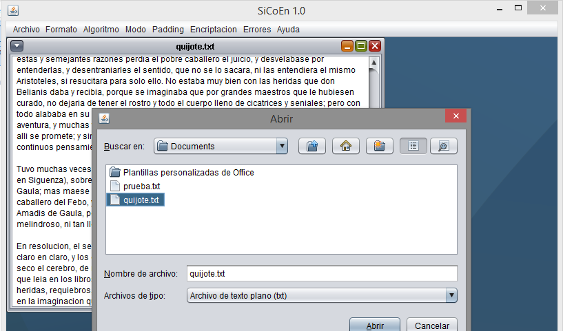

También podremos guardar el texto de una ventana de texto si pulsamos la opción guardar.

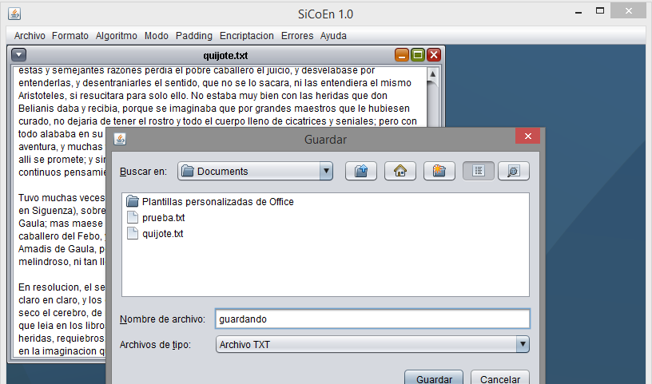

### Menú Formato

Este menú nos permitirá cambiar el formato en el que es visualizado el texto que contiene las ventanas de texto. Entre los formatos de texto disponibles están ASCII, representación binaria o hexadecimal.


Independientemente del formato, lo transformamos en binario si pulsamos la opción.

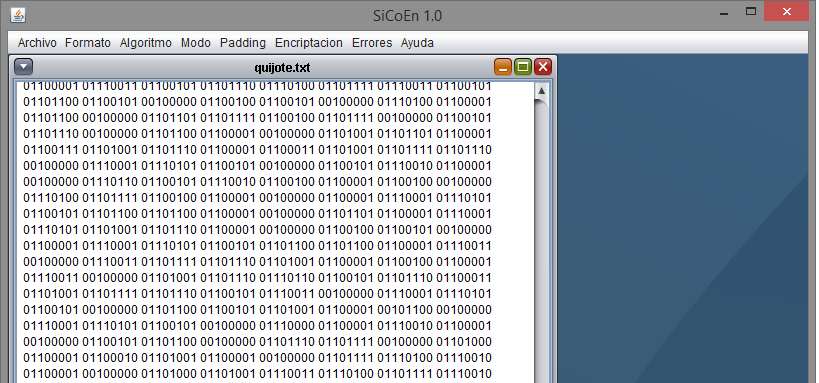

De igual manera, si queremos ver la representación hexadecimal de nuestro texto, solo tenemos que pulsar la opción Hexadecimal.

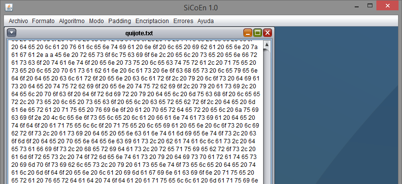

### Menú Algoritmo

Este menú nos permitirá seleccionar el algoritmo simétrico de cifrado en bloque a usar para el cifrado/descifrado del texto que tengamos en nuestra ventana. Los algoritmos disponibles son AES, Blowfish, DES y TripleDES.


### Menú Modo

De forma similar al menú anterior, este menú nos permitir seleccionar los modos de cifrado en bloque que se usarán para cifrar/descifrar nuestro texto. Los modos disponibles son CBC (cifrado de bloques en cadena), CFB (cifrado con retroalimentación), ECB (bloque de código electrónico) y OFB (retroalimentación de salida).


### Menú Padding

En este caso, este menú nos va a permitir seleccionar el **“padding”** o relleno, será lo que usemos para completar los bloques de texto para tener bloques de un mismo tamaño fijo. Los diferentes tipos de padding a usar son:

* **PKCS5**: Cada byte que se añade para completar el bloque tiene el valor del total de bytes añadidos. Sigue el mismo mecanismo que PKCS7, pero para bloques de diferentes tamaños. Ejemplo:
 * **XX XX XX XX XX XX XX XX | XX XX 06 06 06 06 06 06 |**
* **ISO 10126**: Cada byte añadido tiene un valor aleatorio, siendo el último el que indica el número de bytes añadidos. Ejemplo:
 * **XX XX XX XX XX XX XX XX | XX XX XX 43 73 34 30 05 |**


### Menú Encriptación

Este menú es el que contiene tiene las opciones de cifrar o descifrar, acciones muy importantes en nuestro programa. El cifrado o descifrado se hará tomando como parámetros las opciones seleccionadas en los menús anteriores.


### Menú Errores

Este menú es el que contiene las opciones de introducir errores en los mensajes. Nos encontramos con 3 tipos de errores posibles:

* **Error en el texto plano**: un bit en el texto es cambiado antes de ser codificado.
* **Error en la comunicación -> Error de 1 bit**: un bit es cambiado en el texto una vez codificado.
* **Error  en  la  sincronización**:  la  posición  de  inicio  de  un  bloque  no  es  recibida correctamente, esto hace que todos los bits de un bloque sufran un desplazamiento.


### Menú Ayuda

Este menú nos mostrará una ventana con información sobre el desarrollo.


### Cifrado y descifrado

En la siguiente imagen podemos un ejemplo de cifrado y descifrado de un extracto del principio del libro Don Quijote de la Mancha. Como indica el título de la ventana, el texto ha sido cifrado con AES y luego vuelto a descifrar, siendo idéntico el texto original y el resultante del descifrado.

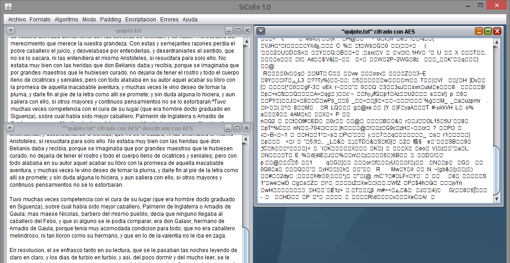

### Error en el texto plano

Ahora comprobamos el resultado de introducir un error en el texto plano antes de ser codificado. Como vemos, simplemente la letra del bloque alterado se verá modificada.

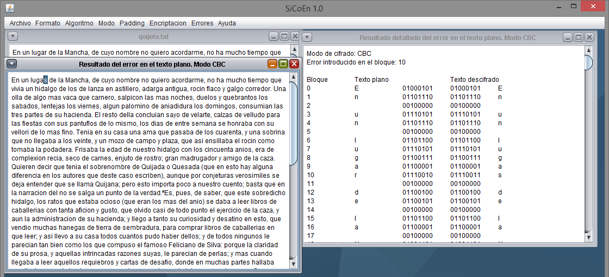

### Error en la comunicación
El siguiente error, escenifica la situación en la que un bit del texto codificado es alterado durante la transmisión del mismo. Como se ve en la ventana de resultado detallado el error se ha producido, sin embargo, el resultado final no es el esperado.

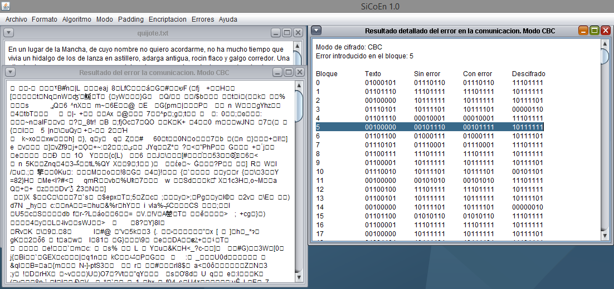

### Error en la sincronización

En el último de los errores, la situación producida es que la posición de inicio de un bloque no es recibida correctamente, lo que hace que el bloque se retransmita erróneamente con todos los bits desplazados. Al igual que ha pasado con el error anterior, el error indicado se genera, pero el resultado no es el esperado con ninguno de los modos de cifrado.

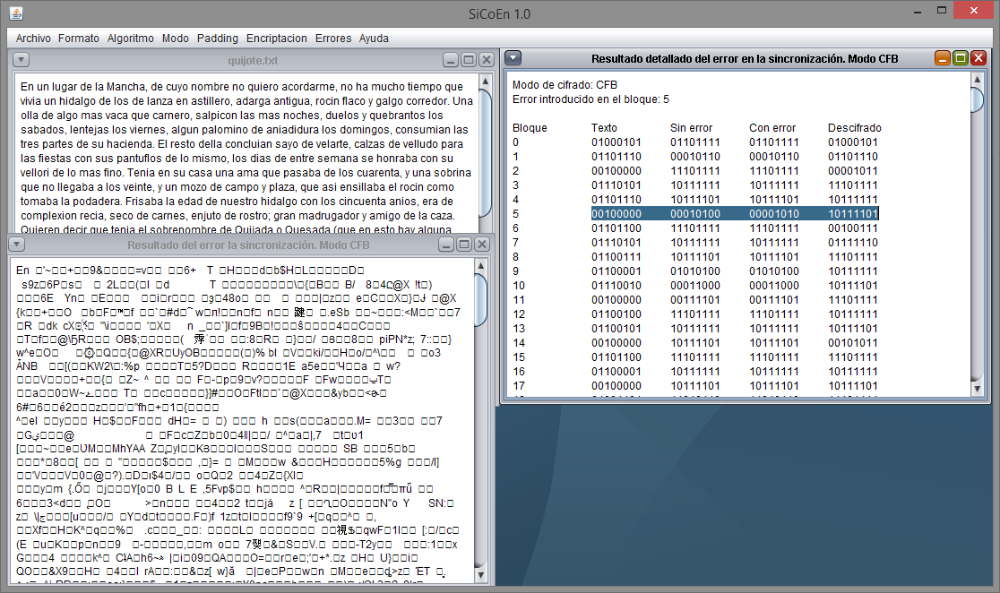

### Información sobre el proyecto

Podríamos considerar la parte final del programa la opción **“Acerca de”** dentro del menú **“Ayuda”**, su única función es mostrar información sobre dicho proyecto.

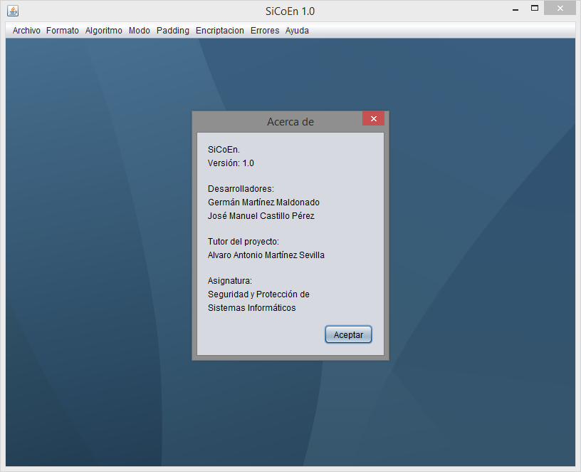


## 9. Documentación de la API de la aplicación

### Paquetes:
* SiCoEn

### Jerarquía de clases (incluye herencias):
* SiCoEn.Encriptador (Encriptador.java)
* FileFilter
 * SiCoEn.Filtro (Filtro.java)
* SiCoEn.Formato (Formato.java)
* JFrame
 * SiCoEn.Interfaz (Interfaz.java)
* SiCoEn.SiCoEn (SiCoEn.java)
* JInternalFrame
 * SiCoEn.Texto (Texto.java)
_ _ _

### Clase SiCoEn.Encriptador

#### Métodos públicos

* Encriptador()
* int getAlgoritmo()
* int getModo()
* int getPadding()
* void setAlgoritmo (int algoritmo)
* void setModo (int modo)
* void setPadding (int padding)
* String cadenaAlgoritmo()
* String cadenaModo()
* String cadenaPadding()
* Cipher generarCifrador (int func)
* String cifrar (File origen)
* String descifrar (File origen)
* int numeroBloques (String texto)

#### Atributos públicos estáticos

* static final int ALGORITMO_AES = 20
* static final int ALGORITMO_BLOW = 21
* static final int ALGORITMO_DES = 22
* static final int ALGORITMO_TDES = 23
* static final int MODO_CBC = 30
* static final int MODO_CFB = 31
* static final int MODO_ECB = 32
* static final int MODO_OFB = 33
* static final int PADDING_PKCS = 40
* static final int PADDING_ISO = 41
* static final int CIFRADOR = 100
* static final int DESCIFRADOR = 101

#### Atributos privados

* int algoritmo
* int modo
* int padding
* KeyGenerator generadorClave_aes
* KeyGenerator generadorClave_blow
* KeyGenerator generadoClave_des
* KeyGenerator generadorClave_tdes
* SecretKey clave_aes
* SecretKey clave_blow
* SecretKey clave_des
* SecretKey clave_tdes
* IvParameterSpec iv8
* IvParameterSpec iv16

#### Descripción detallada

Encriptador usado para las operaciones de cifrado y descifrado

**Autor:**
Germán Martínez Maldonado
José Manuel Castillo Pérez

**Versión:**
0.9

*Definición en la línea 29 del archivo Encriptador.java.*

#### Documentación del constructor y destructor

* **SiCoEn.Encriptador.Encriptador()**: Constructor del encriptador.
 * *Definición en la línea 100 del archivo Encriptador.java.*

#### Documentación de las funciones miembro

* **int SiCoEn.Encriptador.getAlgoritmo()**: Método que devuelve el código interno del algoritmo actual del encriptador.
 * **Devuelve:** Algoritmo actual del encriptador (AES/Blowfish/DES/TripleDES).
 * *Definición en la línea 135 del archivo Encriptador.java.*

* **int SiCoEn.Encriptador.getModo()**: Método que devuelve el código interno del modo actual del encriptador.
 * **Devuelve:** Algoritmo actual del encriptador (CBC/CFB/ECB/OFB).
 * *Definición en la línea 144 del archivo Encriptador.java.*

* **int SiCoEn.Encriptador.getPadding()**: Método que devuelve el código interno del padding actual del encriptador.
 * **Devuelve:** Algoritmo actual del encriptador (PKCS5/ISO 10126).
 * *Definición en la línea 153 del archivo Encriptador.java.*

* **void SiCoEn.Encriptador.setAlgoritmo (int algoritmo)**: Método para cambiar el algoritmo actual del encriptador mediante su código interno.
 * **Parámetros.** algoritmo: Algoritmo al que cambiar (AES/Blowfish/DES/TripleDES).
 * *Definición en la línea 163 del archivo Encriptador.java.*

* **void SiCoEn.Encriptador.setModo (int modo)**: Método para cambiar el modo actual del encriptador mediante su código interno.
 * **Parámetros.** modo: Modo al que cambiar (CBC/CFB/ECB/OFB).
 * *Definición en la línea 173 del archivo Encriptador.java.*

* **void SiCoEn.Encriptador.setPadding (int padding)**: Método para cambiar el padding actual del encriptador mediante su código interno.
 * **Parámetros.** padding: Padding al que cambiar (PKCS5/ISO 10126).
 * *Definición en la línea 183 del archivo Encriptador.java.*

* **String SiCoEn.Encriptador.cadenaAlgoritmo()**: Método que devuelve una cadena de texto con el algoritmo seleccionado para el encriptador.
 * **Devuelve:** Cadena de texto con el algoritmo actual.
 * *Definición en la línea 193 del archivo Encriptador.java.*

* **String SiCoEn.Encriptador.cadenaModo()**: Método que devuelve una cadena de texto con el modo seleccionado para el encriptador.
 * **Devuelve:** Cadena de texto con el modo actual.
 * *Definición en la línea 220 del archivo Encriptador.java.*

* **String SiCoEn.Encriptador.cadenaPadding()**: Método que devuelve una cadena de texto con el padding seleccionado para el encriptador.
 * **Devuelve:** Cadena de texto con el padding actual.
 * *Definición en la línea 247 del archivo Encriptador.java.*

* **Cipher SiCoEn.Encriptador.generarCifrador (int func)**: Método que genera el cifrador con el que se realizarán las operaciones de cifrado y descifrado de texto.
 * **Parámetros.** func: Código que indica si se va a generar un encriptador para cifrar texto o para descifrarlo.
 * **Devuelve:** Encriptador que cifrará o descifrará texto.
 * *Definición en la línea 270 del archivo Encriptador.java.*

* **String SiCoEn.Encriptador.cifrar (File origen)**: Método que cifrará el texto según los valores actuales del encriptador generado.
 * **Parámetros.** origen: Archivo con el texto de la ventana actual que se usará durante el cifrado.
 * **Devuelve:** Texto cifrado según los valores del encriptador.
 * *Definición en la línea 340 del archivo Encriptador.java.*

* **String SiCoEn.Encriptador.descifrar (File origen)**: Método que descifrará el texto según los valores actuales del encriptador generado.
 * **Parámetros.** origen: Archivo con el texto de la ventana actual cifrado que se usará durante el descifrado.
 * **Devuelve:** Texto descifrado según los valores del encriptador.
 * *Definición en la línea 383 del archivo Encriptador.java.*

* **int SiCoEn.Encriptador.numeroBloques (String texto)**: Método que devuelve el número de bloques que tiene un texto.
 * **Parámetros.** texto: Texto del que se quieren conocer el número de bloques.
 * **Devuelve:** Número de bloques del texto.
 * *Definición en la línea 424 del archivo Encriptador.java.*

#### Documentación de los datos miembro

* **final int SiCoEn.Encriptador.ALGORITMO_AES = 20[static]**: Código interno que representa el algoritmo AES.
 * *Definición en la línea 34 del archivo Encriptador.java.*

* **final int SiCoEn.Encriptador.ALGORITMO_BLOW = 21[static]**: Código interno que representa el algoritmo Blowfish.
 * *Definición en la línea 38 del archivo Encriptador.java.*

* **final int SiCoEn.Encriptador.ALGORITMO_DES = 22[static]**: Código interno que representa el algoritmo DES.
 * *Definición en la línea 42 del archivo Encriptador.java.*

* **final int SiCoEn.Encriptador.ALGORITMO_TDES = 23[static]**: Código interno que representa el algoritmo TripleDES.
 * *Definición en la línea 46 del archivo Encriptador.java.*

* **final int SiCoEn.Encriptador.MODO_CBC = 30[static]**: Código interno que representa el modo CBC.
 * *Definición en la línea 50 del archivo Encriptador.java.*

* **final int SiCoEn.Encriptador.MODO_CFB = 31[static]**: Código interno que representa el modo CFB.
 * *Definición en la línea 54 del archivo Encriptador.java.*

* **final int SiCoEn.Encriptador.MODO_ECB = 32[static]**: Código interno que representa el modo ECB.
 * *Definición en la línea 58 del archivo Encriptador.java.*

* **final int SiCoEn.Encriptador.MODO_OFB = 33[static]**: Código interno que representa el modo OFB.
 * *Definición en la línea 62 del archivo Encriptador.java.*

* **final int SiCoEn.Encriptador.PADDING_PKCS = 40[static]**: Código interno que representa el padding PKC5.
 * *Definición en la línea 66 del archivo Encriptador.java.*

* **final int SiCoEn.Encriptador.PADDING_ISO = 41[static]**: Código interno que representa el padding ISO 10126.
 * *Definición en la línea 70 del archivo Encriptador.java.*

* **final int SiCoEn.Encriptador.CIFRADOR = 100[static]**: Código interno que representa el modo cifrador.
 * *Definición en la línea 74 del archivo Encriptador.java.*

* **final int SiCoEn.Encriptador.DESCIFRADOR = 101[static].**: Código interno que representa el modo descifrador.
 * *Definición en la línea 78 del archivo Encriptador.java.*

* **int SiCoEn.Encriptador.algoritmo[private]**: Valor que indica el algoritmo actual seleccionado en el programa.
 * *Definición en la línea 80 del archivo Encriptador.java.*

* **int SiCoEn.Encriptador.modo[private]**: Valor que indica el modo actual del cifrador (cifrar o descifrar).
 * *Definición en la línea 81 del archivo Encriptador.java.*

* **int SiCoEn.Encriptador.padding[private]**: Valor que indica el padding actual seleccionado en el programa.
 * *Definición en la línea 82 del archivo Encriptador.java.*

* **KeyGenerator SiCoEn.Encriptador.generadorClave_aes[private]**: Generador de llaves para el cifrado con AES.
 * *Definición en la línea 84 del archivo Encriptador.java.*

* **KeyGenerator SiCoEn.Encriptador.generadorClave_blow[private]**: Generador de llaves para el cifrado con Blowfish.
 * *Definición en la línea 85 del archivo Encriptador.java.*

* **KeyGenerator SiCoEn.Encriptador.generadorClave_des[private]**: Generador de llaves para el cifrado con DES.
 * *Definición en la línea 86 del archivo Encriptador.java.*

* **KeyGenerator SiCoEn.Encriptador.generadorClave_tdes[private]**: Generador de llaves para el cifrado con TripleDES.
 * *Definición en la línea 87 del archivo Encriptador.java.*

* **SecretKey SiCoEn.Encriptador.clave_aes[private]**: Clave secreta generada para cifrar usando AES.
 * *Definición en la línea 89 del archivo Encriptador.java.*

* **SecretKey SiCoEn.Encriptador.clave_blow[private]**: Clave secreta generada para cifrar usando Blowfish.
 * *Definición en la línea 90 del archivo Encriptador.java.*

* **SecretKey SiCoEn.Encriptador.clave_des[private]**: Clave secreta generada para cifrar usando DES.
 * *Definición en la línea 91 del archivo Encriptador.java.*

* **SecretKey SiCoEn.Encriptador.clave_tdes[private]**: Clave secreta generada para cifrar usando TripleDES.
 * *Definición en la línea 92 del archivo Encriptador.java.*

* **IvParameterSpec SiCoEn.Encriptador.iv8[private]**: Vector de inicialización de 8 bytes.
 * *Definición en la línea 94 del archivo Encriptador.java.*

* **IvParameterSpec SiCoEn.Encriptador.iv16[private]**: Vector de inicialización de 16 bytes. Usado para cifrar con AES.
 * *Definición en la línea 95 del archivo Encriptador.java.*

_ _ _


### Clase SiCoEn.Filtro

#### Métodos públicos

* Filtro (int tipoFiltro, String extension)
* int getTipoFiltro()
* String getExtension()
* boolean accept (File f)
* String getDescription()

#### Métodos públicos estáticos

* static String getFileExtension (File f)

#### Atributos públicos estáticos

* static final int ABRIR_TEXTO_PLANO = 1
* static final int GUARDAR = 4

#### Descripción detallada

Filtro de archivos.

**Autor:**
Germán Martínez Maldonado
José Manuel Castillo Pérez

**Versión:**
0.9

*Definición en la línea 13 del archivo Filtro.java.*

#### Documentación del constructor y destructor

* **SiCoEn.Filtro.Filtro (int tipoFiltro, String extension)**: Constructor del filtro.
 * **Parámetros.** tipoFiltro: Tipo de filtro a crear de los predefinidos.
 * **Parámetros.** extension: Extensión concreta del filtro.
 * *Definición en la línea 32 del archivo Filtro.java.*

#### Documentación de las funciones miembro

* **int SiCoEn.Filtro.getTipoFiltro()**: Devuelve el tipo de filtro seleccionado.
 * **Devuelve:** Tipo de filtro seleccionado.
 * *Definición en la línea 62 del archivo Filtro.java.*

* **String SiCoEn.Filtro.getExtension()**: Devuelve la extensión del tipo de filtro seleccionado.
 * **Devuelve:** Extensión del tipo de filtro seleccionado.
 * *Definición en la línea 71 del archivo Filtro.java.*

* **boolean SiCoEn.Filtro.accept (File f)**: Aceptar un archivo como seleccionable.
 * **Parámetros.** f: Archivo seleccionable.
 * **Devuelve:** Verdadero si el archivo seleccionable se acepta, falso en caso contrario.
 * *Definición en la línea 83 del archivo Filtro.java.*

* **String SiCoEn.Filtro.getDescription()**: Devuelve la descripción del filtro.
 * **Devuelve:** Descripción del filtro.
 * *Definición en la línea 110 del archivo Filtro.java.*

* **static String SiCoEn.Filtro.getFileExtension (File f)[static]**: Obtiene la extensión del archivo seleccionado.
 * **Parámetros.** f: Archivo seleccionado.
 * **Devuelve:** Extensión del archivo seleccionado.
 * *Definición en la línea 45 del archivo Filtro.java.*

#### Documentación de los datos miembro

* **final int SiCoEn.Filtro.ABRIR_TEXTO_PLANO = 1[static]**: Código interno que representa filtro de archivo de texto plano.
 * *Definición en la línea 18 del archivo Filtro.java.*

* **final int SiCoEn.Filtro.GUARDAR = 4[static]**: Código interno que representa filtro de guardado.
 * *Definición en la línea 22 del archivo Filtro.java.*

_ _ _


### Clase SiCoEn.Formato

#### Métodos públicos estáticos

* static String ascii_to_hex (String texto)
* static String ascii_to_bin (String texto)
* static String hex_to_ascii (String texto)
* static String bin_to_ascii (String texto)

#### Atributos públicos estáticos

* static final int FORMATO_ASCII = 10
* static final int FORMATO_BIN = 11
* static final int FORMATO_HEX = 12

#### Descripción detallada

Clase que gestiona los diferentes formatos en los que se puede mostrar el texto.

**Autor:**
Germán Martínez Maldonado
José Manuel Castillo Pérez

**Versión:**
0.9

*Definición en la línea 13 del archivo Formato.java.*

#### Documentación de las funciones miembro

* **static String SiCoEn.Formato.ascii_to_hex (String texto)[static]**: Método que convierte un texto recibido en formato ASCII a formato hexadecimal.
 * **Parámetros.** texto: Texto en formato ASCII que se va a convertir.
 * **Devuelve:** Texto convertido en formato hexadecimal.
 * *Definición en la línea 35 del archivo Formato.java.*

* **static String SiCoEn.Formato.ascii_to_bin (String texto)[static]**: Método que convierte un texto recibido en formato ASCII a formato binario.
 * **Parámetros.** texto: Texto en formato ASCII que se va a convertir.
 * **Devuelve:** Texto convertido en formato binario.
 * *Definición en la línea 56 del archivo Formato.java.*

* **static String SiCoEn.Formato.hex_to_ascii (String texto)[static]**: Método que convierte un texto recibido en formato hexadecimal a formato ASCII.
 * **Parámetros.** texto: Texto en formato hexadecimal que se va a convertir.
 * **Devuelve:** Texto convertido en formato ASCII.
 * *Definición en la línea 88 del archivo Formato.java.*

* **static String SiCoEn.Formato.bin_to_ascii (String texto)[static]**: Método que convierte un texto recibido en formato binario a formato ASCII.
 * **Parámetros.** texto: Texto en formato binario que se va a convertir.
 * **Devuelve:** Texto convertido en formato ASCII.
 * *Definición en la línea 111 del archivo Formato.java.*

#### Documentación de los datos miembro

* **final int SiCoEn.Formato.FORMATO_ASCII = 10[static]**: Código interno que representa la selección de formato ASCII.
 * *Definición en la línea 18 del archivo Formato.java.*

* **final int SiCoEn.Formato.FORMATO_BIN = 11[static]**: Código interno que representa la selección de formato binario.
 * *Definición en la línea 22 del archivo Formato.java.*

* **final int SiCoEn.Formato.FORMATO_HEX = 12[static]**: Código interno que representa la selección de formato hexadecimal.
 * *Definición en la línea 26 del archivo Formato.java.*

_ _ _


### Clase SiCoEn.Interfaz

#### Métodos públicos

* Interfaz()

#### Métodos privados

* void opcionCifrar (java.awt.event.ActionEvent evt)
* void opcionDescifrar (java.awt.event.ActionEvent evt)
* void accionAbrir (java.awt.event.ActionEvent evt)
* void accionGuardar (java.awt.event.ActionEvent evt)
* void accionNuevo (java.awt.event.ActionEvent evt)
* void accionSalir (java.awt.event.ActionEvent evt)
* void marca_algoritmo_aes (java.awt.event.ItemEvent evt)
* void marca_algoritmo_blow (java.awt.event.ItemEvent evt)
* void marca_algoritmo_des (java.awt.event.ItemEvent evt)
* void marca_algoritmo_tdes (java.awt.event.ItemEvent evt)
* void marca_modo_cbc (java.awt.event.ItemEvent evt)
* void marca_modo_cfb (java.awt.event.ItemEvent evt)
* void marca_modo_ecb (java.awt.event.ItemEvent evt)
* void marca_modo_ofb (java.awt.event.ItemEvent evt)
* void marca_padding_pkcs (java.awt.event.ItemEvent evt)
* void marca_padding_iso (java.awt.event.ItemEvent evt)
* void opcion_error_cifrado (java.awt.event.ActionEvent evt)
* void accion_error_com_1 (java.awt.event.ActionEvent evt)
* void opcion_error_sincronizacion (java.awt.event.ActionEvent evt)
* void accion_formato_ascii (java.awt.event.ActionEvent evt)
* void accion_formato_bin (java.awt.event.ActionEvent evt)
* void accion_formato_hex (java.awt.event.ActionEvent evt)
* void accionAcerca (java.awt.event.ActionEvent evt)

#### Atributos privados

Encriptador encriptador

#### Descripción detallada

Ventana principal de la interfaz de la aplicación.

**Autor:**
Germán Martínez Maldonado
José Manuel Castillo Pérez

**Versión:**
0.9

*Definición en la línea 29 del archivo Interfaz.java.*

### Documentación del constructor y destructor

* **SiCoEn.Interfaz.Interfaz()**: Constructor de la ventana principal de la interfaz de la aplicación.
 * *Definición en la línea 37 del archivo Interfaz.java.*

#### Documentación de las funciones miembro

* **void SiCoEn.Interfaz.opcionCifrar (java.awt.event.ActionEvent evt)[private]**: Método que gestiona la opción de cifrar texto. Cifrará el texto de la ventana actual según las opciones seleccionadas.
 * **Parámetros.** evt: Evento disparador de la acción (seleccionar opción "Encriptación -> Cifrar")
 * *Definición en la línea 357 del archivo Interfaz.java.*

* **void SiCoEn.Interfaz.opcionDescifrar (java.awt.event.ActionEvent evt)[private]**: Método que gestiona la opción de descifrar texto. Descifrará el texto de la ventana actual según las opciones seleccionadas.
 * **Parámetros.** evt: Evento disparador de la acción (seleccionar opción "Encriptación -> Descifrar")
 * *Definición en la línea 396 del archivo Interfaz.java.*

* **void SiCoEn.Interfaz.accionAbrir (java.awt.event.ActionEvent evt)[private]**: Método que gestiona la opción de abrir de archivos de texto. Muestra una ventana con un explorador de archivos para seleccionar un archivo de texto a abrir en una nueva ventana.
 * **Parámetros.** evt: Evento disparador de la acción (seleccionar opción "Archivo -> Abrir")
 * *Definición en la línea 429 del archivo Interfaz.java.*

* **void SiCoEn.Interfaz.accionGuardar (java.awt.event.ActionEvent evt)[private]**: Método que gestiona la opción de guardar texto en un archivo. Muestra una ventana con un explorar de archivos para seleccionar donde guardar un archivo con el texto de la ventana actual.
 * **Parámetros.** evt: Evento disparador de la acción (seleccionar opción "Archivo -> Guardar")
 * *Definición en la línea 479 del archivo Interfaz.java.*

* **void SiCoEn.Interfaz.accionNuevo (java.awt.event.ActionEvent evt)[private]**: Método que gestiona la opción de crear una nueva ventana de texto. Crea una nueva ventana de texto en blanco.
 * **Parámetros.** evt: Evento disparador de la acción (seleccionar opción "Archivo -> Nuevo")
 * *Definición en la línea 562 del archivo Interfaz.java.*

* **void SiCoEn.Interfaz.accionSalir (java.awt.event.ActionEvent evt)[private]**: Método que gestiona la opción de salir del programa. Cierra el programa.
 * **Parámetros.** evt: Evento disparador de la acción (seleccionar opción "Archivo -> Salir")
 * *Definición en la línea 575 del archivo Interfaz.java.*

* **void SiCoEn.Interfaz.marca_algoritmo_aes (java.awt.event.ItemEvent evt)[private]**: Método que gestiona la selección del algoritmo AES.
 * **Parámetros.** evt: Evento disparador de la acción (marcar "Algoritmo -> AES")
 * *Definición en la línea 584 del archivo Interfaz.java.*

* **void SiCoEn.Interfaz.marca_algoritmo_blow (java.awt.event.ItemEvent evt)[private]**: Método que gestiona la selección del algoritmo Blowfish.
 * **Parámetros.** evt: Evento disparador de la acción (marcar "Algoritmo -> Blowfish")
 * *Definición en la línea 596 del archivo Interfaz.java.*

* **void SiCoEn.Interfaz.marca_algoritmo_des (java.awt.event.ItemEvent evt)[private]**: Método que gestiona la selección del algoritmo DES.
 * **Parámetros.** evt: Evento disparador de la acción (marcar "Algoritmo -> DES")
 * *Definición en la línea 607 del archivo Interfaz.java.*

* **void SiCoEn.Interfaz.marca_algoritmo_tdes (java.awt.event.ItemEvent evt)[private]**: Método que gestiona la selección del algoritmo TripleDES.
 * **Parámetros.** evt: Evento disparador de la acción (marcar "Algoritmo -> TripleDES")
 * *Definición en la línea 619 del archivo Interfaz.java.*

* **void SiCoEn.Interfaz.marca_modo_cbc (java.awt.event.ItemEvent evt)[private]**: Método que gestiona la selección del modo de cifrado CBC.
 * **Parámetros.** evt: Evento disparador de la acción (marcar "Modo -> CBC")
 * *Definición en la línea 630 del archivo Interfaz.java.*

* **void SiCoEn.Interfaz.marca_modo_cfb (java.awt.event.ItemEvent evt)[private]**: Método que gestiona la selección del modo de cifrado CFB.
 * **Parámetros.** evt: Evento disparador de la acción (marcar "Modo -> CFB")
 * *Definición en la línea 641 del archivo Interfaz.java.*

* **void SiCoEn.Interfaz.marca_modo_ecb (java.awt.event.ItemEvent evt)[private]**: Método que gestiona la selección del modo de cifrado ECB.
 * **Parámetros.** evt: Evento disparador de la acción (marcar "Modo -> ECB")
 * *Definición en la línea 652 del archivo Interfaz.java.*

* **void SiCoEn.Interfaz.marca_modo_ofb (java.awt.event.ItemEvent evt)[private]**: Método que gestiona la selección del modo de cifrado OFB.
 * **Parámetros.** evt: Evento disparador de la acción (marcar "Modo -> OFB")
 * *Definición en la línea 663 del archivo Interfaz.java.*

* **void SiCoEn.Interfaz.marca_padding_pkcs (java.awt.event.ItemEvent evt)[private]**: Método que gestiona la selección del padding PKCS5.
 * **Parámetros.** evt: Evento disparador de la acción (marcar "Padding -> PKCS5")
 * *Definición en la línea 674 del archivo Interfaz.java.*

* **void SiCoEn.Interfaz.marca_padding_iso (java.awt.event.ItemEvent evt)[private]**: Método que gestiona la selección del padding ISO 10126.
 * **Parámetros.** evt: Evento disparador de la acción (marcar "Padding -> ISO 10126")
 * *Definición en la línea 685 del archivo Interfaz.java.*

* **void SiCoEn.Interfaz.opcion_error_cifrado (java.awt.event.ActionEvent evt)[private]**: Método que gestiona la selección de la opción de error en el texto plano. Crea una ventana en la que se muestra el error introducido y otra que muestra el resultado de dicho error en la descodificación.
 * **Parámetros.** evt: Evento disparador de la acción (seleccionar opción "Errores -> Error en el texto plano")
 * *Definición en la línea 699 del archivo Interfaz.java.*

* **void SiCoEn.Interfaz.opcion_error_sincronizacion (java.awt.event.ActionEvent evt)[private]**: Método que gestiona la selección de la opción de error en la sincronización. Crea una ventana en la que se muestra el error introducido y otra que muestra el resultado de dicho error en la descodificación.
 * **Parámetros.** evt: Evento disparador de la acción (seleccionar opción "Errores -> Error en la sincronización")
 * *Definición en la línea 996 del archivo Interfaz.java.*

* **void SiCoEn.Interfaz.accion_error_com_1 (java.awt.event.ActionEvent evt)[private]**: Método que gestiona la selección de la opción de error en la comunicación. Crea una ventana en la que se muestra el error introducido y otra que muestra el resultado de dicho error en la descodificación.
 * **Parámetros.** evt: Evento disparador de la acción (seleccionar opción "Errores -> Error en la comunicación -> Error de 1 bit")
 * *Definición en la línea 829 del archivo Interfaz.java.*

* **void SiCoEn.Interfaz.accion_formato_ascii (java.awt.event.ActionEvent evt)[private]**: Método que gestiona la selección del formato ASCII. Cambia el texto de la ventana actual formato ASCII.
 * **Parámetros.** evt: Evento disparador de la acción (marcar "Formato -> ASCII")
 * *Definición en la línea 1164 del archivo Interfaz.java.*

* **void SiCoEn.Interfaz.accion_formato_bin (java.awt.event.ActionEvent evt)[private]**: Método que gestiona la selección del formato binario. Cambia el texto de la ventana actual formato binario.
 * **Parámetros.** evt: Evento disparador de la acción (marcar "Formato -> Binario")
 * *Definición en la línea 1201 del archivo Interfaz.java.*

* **void SiCoEn.Interfaz.accion_formato_hex (java.awt.event.ActionEvent evt)[private]**: Método que gestiona la selección del formato hexadecimal. Cambia el texto de la ventana actual formato hexadecimal.
 * **Parámetros.** evt: Evento disparador de la acción (marcar "Formato ->Hexadecimal")
 * *Definición en la línea 1238 del archivo Interfaz.java.*

* **void SiCoEn.Interfaz.accionAcerca (java.awt.event.ActionEvent evt)[private]**: Método que muestra información sobre los desarrolladores del proyecto.
 * **Parámetros.** evt: Evento disparador de la acción (seleccionar opción "Ayuda -> Acerca de")
 * *Definición en la línea 1274 del archivo Interfaz.java.*

#### Documentación de los datos miembro

* **Encriptador SiCoEn.Interfaz.encriptador[private]**: Encriptador que se usará para cifrar o descifrar el texto de las ventanas.
 * *Definición en la línea 31 del archivo Interfaz.java.*

_ _ _


### Clase SiCoEn.SiCoEn

#### Métodos públicos estáticos

static void main (String args[])

#### Descripción detallada

Clase principal de la aplicación.

**Autor:**
Germán Martínez Maldonado
José Manuel Castillo Pérez

**Versión:**
0.9

*Definición en la línea 10 del archivo SiCoEn.java.*

#### Documentación de las funciones miembro

* **static void SiCoEn.SiCoEn.main (String args[])[static]**: Método principal de la aplicación.
 * **Parámetros.** args: El argumento de línea de comandos.
 * *Definición en la línea 17 del archivo SiCoEn.java.*

_ _ _


### Clase SiCoEn.Texto

#### Métodos públicos

* Texto (String texto)
* void setArchivo (File archivo)
* File getArchivo()
* void setFormato (int formato)
* int getFormato()
* String getTexto()
* void setTexto (String texto)

#### Descripción detallada

Ventana de texto.

**Autor:**
Germán Martínez Maldonado
José Manuel Castillo Pérez

**Versión:**
0.9

*Definición en la línea 12 del archivo Texto.java.*

#### Documentación del constructor y destructor

* **SiCoEn.Texto.Texto (String texto)**: Constructor de la ventana de texto.
 * **Parámetros.** texto: Texto que será mostrado en la ventana una vez sea creada.
 * *Definición en la línea 22 del archivo Texto.java.*

#### Documentación de las funciones miembro

* **void SiCoEn.Texto.setArchivo (File archivo)**: Método  que  asigna  un  archivo  de  texto  a  una  ventana  de  texto.  Necesario  para  las operaciones de cifrado y descifrado.
 * **Parámetros.** archivo: Archivo de texto que será asignado a la ventana de texto.
 * *Definición en la línea 36 del archivo Texto.java.*

* **File SiCoEn.Texto.getArchivo()**: Método que devuelve el archivo al que está asignado la ventana de texto.
 * **Devuelve:** Archivo al que está asignado la ventana de texto.
 * *Definición en la línea 45 del archivo Texto.java.*

* **void SiCoEn.Texto.setFormato (int formato)**: Método que asigna el formato en el que está el texto de la ventana (ASCII, binario o hexadecimal).
 * **Parámetros.** formato: Formato al que se va a cambiar el texto de la ventana.
 * *Definición en la línea 55 del archivo Texto.java.*

* **int SiCoEn.Texto.getFormato()**: Método que devuelve el formato en el que está el texto de la ventana.
 * **Devuelve:** Formato del texto de la ventana.
 * *Definición en la línea 64 del archivo Texto.java.*

* **String SiCoEn.Texto.getTexto()**: Método que devuelve el texto actual que se muestra en la ventana.
 * **Devuelve:** Texto de la ventana.
 * *Definición en la línea 73 del archivo Texto.java.*

* **void SiCoEn.Texto.setTexto (String texto)**: Método que permite asignar texto a la ventana para que sea mostrado en ella.
 * **Parámetros.** texto: Texto a introducir en la ventana.
 * *Definición en la línea 91 del archivo Texto.java.*

_ _ _


## 10. Conclusiones

Una vez realizado el proyecto y según las bases teóricas vistas, las conclusiones sobre el funcionamiento de los distintos modos de cifrado respecto a las simulaciones de los errores deberían ser las mismas presentadas durante la exposición:

* Cuando el error se introduce en el texto plano, generalmente no hay grandes problemas, simplemente se verá un cambio en algún carácter una vez sea decodificado.
* Cuando se producen errores en la codificación, lo mejor es usar un modo OFB, ya que gracias a su retroalimentación interna, el error será mínimo: si solo un bit ha sido alterado, solo un carácter se verá modificado.
* Cuando se produce un error en la sincronización, en ese caso, lo mejor es el modo CFB, ya que también gracias a su retroalimentación, un error que se produzca en un bit, generara basura, pero después de 9 bits, el sistema se recupera, recuperando el texto.
* Por lo dicho, los modos de cifrado que usan retroalimentación permitirán recuperar en mayor o menor medida la información que se vea alterada. No pasará lo mismo en los modos que funcionan mediante bloques en cadena o independientes, ya que en estos el error se propagarán o se mantendrán en el sistema.

Como hemos explicado, teóricamente deberíamos obtener estos resultados con el programa que hemos desarrollado. El problema ha estado en que se buscaba hacer un programa multiplataforma desarrollado en Java, haciendo uso de su API para criptografía mediante el paquete **“javax.crypto”**, pero una vez que estaba todo el proyecto montado, los comportamientos obtenidos no eran los previstos.

Se intentó aislar las funcionalidades fundamentales de cifrado y descifrado provistas por la API, para usar solo lo que fuera estrictamente necesario y desarrollar una implementación propia que pudiera complementarse con la existente, pero en este caso también fue imposible encontrar la manera de interoperar con los métodos que estaban a más bajo nivel.

Por todo lo surgido, la única alternativa que se planteaba era desarrollar una API completamente propia que implementara todas las funcionalidades de cifrado de información, modos de cifrado y padding de los bloques, pero este trabajo requeriría un estudio mucho más en profundidad de la temática a tratar para adquirir los conocimientos necesarios, lo que con una fecha de entrega tan cercana no nos sería posible cumplir.

Motivados por todo lo expuesto, realizamos un trabajo que tuviera una explicación y documentación sobre el proyecto descrito para que sirviera como ilustración de lo que se había conseguido con el trabajo realizado, y también de lo que no se había llegado a conseguir.


## 11. Bibliografía

* Tema 2. Técnicas de cifrado simétricas. Seguridad y Protección de Sistemas Informáticos.
* [http://en.wikipedia.org/wiki/Block_cipher_mode_of_operation](http://en.wikipedia.org/wiki/Block_cipher_mode_of_operation)
* [http://es.wikipedia.org/wiki/3DES](http://es.wikipedia.org/wiki/3DES)
* [http://es.wikipedia.org/wiki/Advanced_Encryption_Standard](http://es.wikipedia.org/wiki/Advanced_Encryption_Standard)
* [http://es.wikipedia.org/wiki/Blowfish](http://es.wikipedia.org/wiki/Blowfish)
* [http://es.wikipedia.org/wiki/Cifrado_por_bloques](http://es.wikipedia.org/wiki/Cifrado_por_bloques)
* [http://es.wikipedia.org/wiki/Criptograf%C3%ADa_sim%C3%A9trica](http://es.wikipedia.org/wiki/Criptograf%C3%ADa_sim%C3%A9trica)
* [http://es.wikipedia.org/wiki/Data_Encryption_Standard](http://es.wikipedia.org/wiki/Data_Encryption_Standard)
* [http://lumbreras-criptografia.blogspot.com.es/2013/07/cifrados-por-bloque-blowfish.html](http://lumbreras-criptografia.blogspot.com.es/2013/07/cifrados-por-bloque-blowfish.html)
* [http://redyseguridad.fi-p.unam.mx/proyectos/criptografia/criptografia/index.php/4-criptografia-simetrica-o-de-clave-secreta/41-introduccion-a-la-criptografia-simetrica/413-principales-algoritmos-simetricos?showall=&start=5](http://redyseguridad.fi-p.unam.mx/proyectos/criptografia/criptografia/index.php/4-criptografia-simetrica-o-de-clave-secreta/41-introduccion-a-la-criptografia-simetrica/413-principales-algoritmos-simetricos?showall=&start=5)
* [https://www.ccn-cert.cni.es/publico/serieCCN-STIC401/es/c/cfb.htm](https://www.ccn-cert.cni.es/publico/serieCCN-STIC401/es/c/cfb.htm)
* [http://docs.oracle.com/javase/7/docs/api/javax/crypto/Cipher.html](http://docs.oracle.com/javase/7/docs/api/javax/crypto/Cipher.html)
* [http://docs.oracle.com/javase/7/docs/api/javax/crypto/KeyGenerator.html](http://docs.oracle.com/javase/7/docs/api/javax/crypto/KeyGenerator.html)
* [http://docs.oracle.com/javase/7/docs/api/javax/crypto/SecretKey.html](http://docs.oracle.com/javase/7/docs/api/javax/crypto/SecretKey.html)
* [http://docs.oracle.com/javase/7/docs/api/javax/crypto/spec/IvParameterSpec.html](http://docs.oracle.com/javase/7/docs/api/javax/crypto/spec/IvParameterSpec.html)
